# FreteAPI - Sistema de Agendamento de Fretes

## 🏢 Empresa & Licenciamento

**Desenvolvido por**: [Hosken Technology](https://hoskentechnology.com.br/)  
**Desenvolvedor Principal**: [Hosken Gadu](https://github.com/hoskengadu)  
**Licença**: © 2026 Hosken Technology - Todos os direitos reservados  
**Versão**: 1.0.0  
**Data**: Janeiro 2026

---

## 📋 Índice

- [Visão Geral do Projeto](#-visão-geral-do-projeto)
- [Arquitetura da Aplicação](#-arquitetura-da-aplicação)
- [Domain-Driven Design (DDD)](#-domain-driven-design-ddd)
- [Clean Architecture](#-clean-architecture)
- [Estrutura do Banco de Dados](#-estrutura-do-banco-de-dados)
- [Infraestrutura Multi-Cloud](#-infraestrutura-multi-cloud)
- [Tecnologias Utilizadas](#-tecnologias-utilizadas)
- [Configuração do Ambiente](#-configuração-do-ambiente)
- [Deploy Multi-Cloud](#-deploy-multi-cloud)
- [Monitoramento e Observabilidade](#-monitoramento-e-observabilidade)
- [Segurança](#-segurança)
- [Testes](#-testes)
- [Padrões de Código](#-padrões-de-código)
- [API Documentation](#-api-documentation)
- [Contribuição](#-contribuição)

## 🎯 Visão Geral do Projeto

O **FreteAPI** é uma solução completa para agendamento e gerenciamento de serviços de frete, desenvolvida com **Clean Architecture** e **Domain-Driven Design (DDD)**. A aplicação oferece uma API RESTful robusta para conectar clientes a profissionais de frete, com funcionalidades avançadas de agendamento, disponibilidade e gestão de serviços.

### 🌟 Principais Funcionalidades

- **Gestão de Clientes**: CRUD completo com validações avançadas
- **Gestão de Profissionais**: Cadastro e gerenciamento de prestadores de serviço
- **Sistema de Disponibilidade**: Controle flexível de horários disponíveis
- **Agendamento Inteligente**: Sistema completo de reservas com validações
- **API RESTful**: Endpoints padronizados seguindo OpenAPI 3.0
- **Multi-tenancy Ready**: Arquitetura preparada para múltiplos clientes
- **Event Sourcing**: Rastreamento completo de eventos do sistema

### 🏗️ Características Técnicas

- **Arquitetura**: Clean Architecture com DDD
- **Framework**: .NET 8.0 com ASP.NET Core
- **ORM**: Entity Framework Core 8.0
- **Banco de Dados**: PostgreSQL 15+
- **Containerização**: Docker com multi-stage builds
- **Cloud**: AWS, Azure e Google Cloud Platform
- **Monitoramento**: Application Insights, CloudWatch, Stackdriver

## ☁️ Infraestrutura Multi-Cloud

### Visão Geral da Infraestrutura

A aplicação FreteAPI é deploy em uma infraestrutura multi-cloud robusta que permite execução simultânea em AWS, Azure e Google Cloud Platform, proporcionando alta disponibilidade, disaster recovery e otimização de custos.

### Arquitetura Multi-Cloud

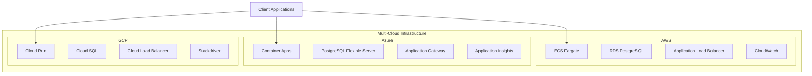

### Terraform - Infrastructure as Code

#### Estrutura Modular

```
terraform/
├── main.tf                     # Configuração principal raiz
├── providers.tf               # Configuração dos providers
├── variables.tf               # Variáveis globais
├── outputs.tf                 # Outputs globais
├── modules/                   # Módulos reutilizáveis
│   ├── common/               # Recursos compartilhados
│   │   ├── docker/          # Templates Docker
│   │   └── docker-compose/  # Configurações Docker Compose
│   ├── aws/                 # Módulos AWS
│   │   ├── main.tf          # Orquestrador principal AWS
│   │   ├── variables.tf     # Variáveis do módulo AWS
│   │   ├── outputs.tf       # Outputs do módulo AWS
│   │   ├── network/         # VPC, subnets, security groups
│   │   ├── rds/             # PostgreSQL RDS
│   │   └── ecs/             # ECS Fargate + ALB
│   ├── azure/               # Módulo Azure
│   │   ├── main.tf          # Container Apps + PostgreSQL
│   │   ├── variables.tf     # Variáveis do módulo Azure
│   │   └── outputs.tf       # Outputs do módulo Azure
│   └── gcp/                 # Módulo GCP
│       ├── main.tf          # Cloud Run + Cloud SQL
│       ├── variables.tf     # Variáveis do módulo GCP
│       └── outputs.tf       # Outputs do módulo GCP
├── environments/             # Configurações por ambiente
│   ├── dev/                 # Ambiente de desenvolvimento
│   │   ├── main.tf          # Configuração principal dev
│   │   ├── variables.tf     # Variáveis do ambiente dev
│   │   ├── outputs.tf       # Outputs do ambiente dev
│   │   └── terraform.tfvars.example
│   └── prod/                # Ambiente de produção
│       ├── main.tf          # Configuração principal prod
│       ├── variables.tf     # Variáveis do ambiente prod
│       ├── outputs.tf       # Outputs do ambiente prod
│       └── terraform.tfvars.example
└── scripts/                 # Scripts de automação
    ├── deploy.sh           # Script de deploy (Linux/Mac)
    ├── deploy.bat          # Script de deploy (Windows)
    └── destroy.sh          # Script de destruição
```

### AWS Architecture

#### Componentes Principais

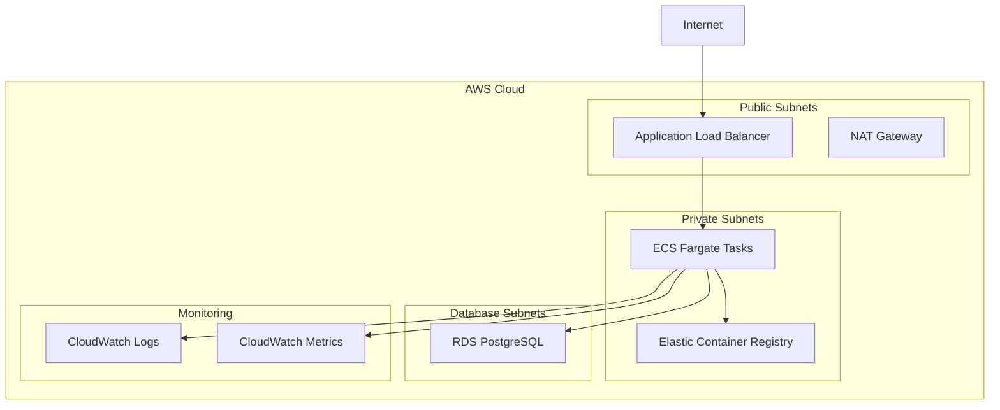

**Recursos AWS:**
- **VPC**: Rede privada isolada com 3 AZs
- **ECS Fargate**: Containers serverless com auto-scaling
- **RDS PostgreSQL**: Banco gerenciado com backups automáticos
- **Application Load Balancer**: Distribuição de tráfego com health checks
- **ECR**: Registry privado para imagens Docker
- **CloudWatch**: Logs centralizados e métricas
- **IAM Roles**: Segurança baseada em princípios de menor privilégio

#### Configuração ECS

```hcl
resource "aws_ecs_task_definition" "api" {
  family                   = "${var.name_prefix}-api"
  network_mode             = "awsvpc"
  requires_compatibilities = ["FARGATE"]
  cpu                      = var.cpu
  memory                   = var.memory
  execution_role_arn       = aws_iam_role.ecs_execution.arn
  task_role_arn           = aws_iam_role.ecs_task.arn

  container_definitions = jsonencode([
    {
      name  = "api"
      image = "${aws_ecr_repository.api.repository_url}:${var.api_version}"
      
      environment = [
        {
          name  = "ASPNETCORE_ENVIRONMENT"
          value = var.environment == "prod" ? "Production" : "Development"
        },
        {
          name  = "ConnectionStrings__DefaultConnection"
          valueFrom = aws_ssm_parameter.db_connection.arn
        }
      ]
      
      healthCheck = {
        command = ["CMD-SHELL", "curl -f http://localhost:${var.container_port}/health || exit 1"]
        interval    = 30
        timeout     = 10
        retries     = 3
        startPeriod = 60
      }
    }
  ])
}
```

### Azure Architecture

#### Componentes Principais

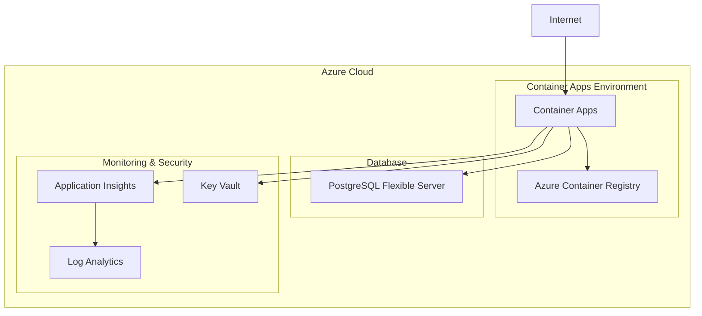

**Recursos Azure:**
- **Container Apps**: Plataforma serverless para containers
- **PostgreSQL Flexible Server**: Banco gerenciado com alta disponibilidade
- **Container Registry**: Registry privado com scanning de vulnerabilidades
- **Application Insights**: APM completo com distributed tracing
- **Key Vault**: Gerenciamento seguro de secrets e certificados
- **Log Analytics**: Análise avançada de logs e métricas

#### Configuração Container Apps

```hcl
resource "azurerm_container_app" "api" {
  name                         = "${var.name_prefix}-api"
  container_app_environment_id = azurerm_container_app_environment.main.id
  resource_group_name         = azurerm_resource_group.main.name
  revision_mode               = "Single"

  template {
    min_replicas    = var.min_replicas
    max_replicas    = var.max_replicas

    container {
      name   = "api"
      image  = "${azurerm_container_registry.main.login_server}/${var.api_image_name}:${var.api_version}"
      cpu    = var.container_cpu
      memory = var.container_memory

      env {
        name        = "ConnectionStrings__DefaultConnection"
        secret_name = "connection-string"
      }

      liveness_probe {
        transport = "HTTP"
        port      = var.container_port
        path      = "/health"
      }

      readiness_probe {
        transport = "HTTP"
        port      = var.container_port
        path      = "/health/ready"
      }
    }
  }
}
```

### Google Cloud Platform Architecture

#### Componentes Principais

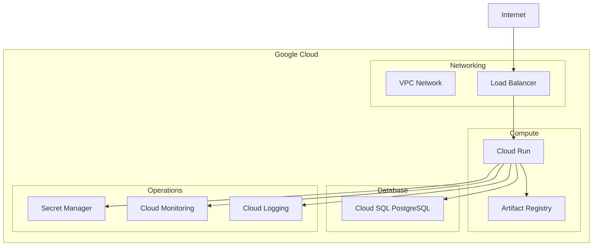

**Recursos GCP:**
- **Cloud Run**: Plataforma serverless completamente gerenciada
- **Cloud SQL**: PostgreSQL gerenciado com alta disponibilidade
- **Artifact Registry**: Registry unificado para artefatos
- **VPC Network**: Rede privada com conectividade segura
- **Secret Manager**: Gerenciamento centralizado de secrets
- **Cloud Monitoring**: Observabilidade completa com SLIs/SLOs

#### Configuração Cloud Run

```hcl
resource "google_cloud_run_v2_service" "api" {
  name     = "${var.name_prefix}-api"
  location = var.region
  project  = var.project_id

  template {
    service_account = google_service_account.cloudrun.email

    scaling {
      min_instance_count = var.min_instances
      max_instance_count = var.max_instances
    }

    containers {
      image = "${var.region}-docker.pkg.dev/${var.project_id}/${google_artifact_registry_repository.main.repository_id}/${var.api_image_name}:${var.api_version}"

      env {
        name = "ConnectionStrings__DefaultConnection"
        value_source {
          secret_key_ref {
            secret  = google_secret_manager_secret.db_connection.secret_id
            version = "latest"
          }
        }
      }

      startup_probe {
        http_get {
          path = "/health"
          port = var.container_port
        }
        initial_delay_seconds = 10
        period_seconds       = 10
        failure_threshold    = 3
      }
    }
  }
}
```

## 🛠️ Tecnologias Utilizadas

### Backend (.NET 8)

| Categoria | Tecnologia | Versão | Propósito |
|-----------|------------|--------|-----------|
| **Framework** | .NET | 8.0 | Runtime principal |
| **Web API** | ASP.NET Core | 8.0 | Framework web |
| **ORM** | Entity Framework Core | 8.0 | Mapeamento objeto-relacional |
| **Database** | PostgreSQL | 15+ | Banco de dados principal |
| **Mediator** | MediatR | 12.0 | Implementação do padrão Mediator |
| **Mapping** | AutoMapper | 12.0 | Mapeamento de objetos |
| **Validation** | FluentValidation | 11.0 | Validação de entrada |
| **Serialization** | System.Text.Json | 8.0 | Serialização JSON |
| **Documentation** | Swashbuckle | 6.5 | Documentação OpenAPI |
| **Health Checks** | Microsoft.AspNetCore.Diagnostics.HealthChecks | 8.0 | Monitoramento de saúde |

### Infrastructure

| Categoria | Tecnologia | Versão | Propósito |
|-----------|------------|--------|-----------|
| **IaC** | Terraform | 1.6+ | Infrastructure as Code |
| **Containers** | Docker | 24.0+ | Containerização |
| **Orchestration** | Docker Compose | 2.0+ | Orquestração local |
| **CI/CD** | GitHub Actions | - | Integração contínua |

### Cloud Providers

| Provider | Serviços | Propósito |
|----------|----------|-----------|
| **AWS** | ECS Fargate, RDS, ALB, ECR, CloudWatch | Container orchestration |
| **Azure** | Container Apps, PostgreSQL Flexible, ACR, App Insights | Serverless containers |
| **GCP** | Cloud Run, Cloud SQL, Artifact Registry, Monitoring | Serverless platform |

### Development Tools

| Categoria | Ferramenta | Propósito |
|-----------|------------|-----------|
| **IDE** | Visual Studio 2022 / VS Code | Desenvolvimento |
| **API Testing** | Postman / Insomnia | Teste de APIs |
| **Database** | pgAdmin / DBeaver | Administração de banco |
| **Monitoring** | Application Insights / CloudWatch | Observabilidade |

## ⚙️ Configuração do Ambiente

### Pré-requisitos de Desenvolvimento

#### Ferramentas Obrigatórias

```bash
# .NET 8 SDK
dotnet --version  # >= 8.0

# Docker Desktop
docker --version  # >= 24.0

# PostgreSQL (local)
psql --version    # >= 15.0

# Git
git --version
```

#### Ferramentas Opcionais

```bash
# Terraform (para infraestrutura)
terraform --version  # >= 1.6

# Cloud CLIs (para deploy)
aws --version     # AWS CLI v2
az --version      # Azure CLI
gcloud --version  # Google Cloud CLI
```

### Setup do Projeto

#### 1. Clone do Repositório

```bash
git clone https://github.com/hoskengadu/FreteAPI.git
cd FreteAPI
```

#### 2. Configuração do Banco de Dados

```bash
# Usando Docker
docker run --name postgres-freteapi \
  -e POSTGRES_DB=freteapi \
  -e POSTGRES_USER=freteapi \
  -e POSTGRES_PASSWORD=sua_senha_aqui \
  -p 5432:5432 \
  -d postgres:15

# Ou usando instalação local do PostgreSQL
createdb freteapi
psql freteapi -c "CREATE USER freteapi WITH PASSWORD 'sua_senha_aqui';"
psql freteapi -c "GRANT ALL PRIVILEGES ON DATABASE freteapi TO freteapi;"
```

#### 3. Configuração da Aplicação

```bash
# Copiar arquivo de configuração
cp appsettings.example.json appsettings.Development.json

# Editar connection string
{
  "ConnectionStrings": {
    "DefaultConnection": "Host=localhost;Database=freteapi;Username=freteapi;Password=sua_senha_aqui"
  }
}
```

#### 4. Execução das Migrações

```bash
# Instalar ferramenta EF Core
dotnet tool install --global dotnet-ef

# Aplicar migrações
dotnet ef database update --project FreteAPI.Infrastructure --startup-project FreteAPI.API

# Executar seed data (opcional)
dotnet run --project FreteAPI.API --seed-data
```

#### 5. Execução Local

```bash
# Executar API
dotnet run --project FreteAPI.API

# Ou usando Docker
docker-compose up -d

# Acessar Swagger UI
# https://localhost:5001/swagger
```

### Configuração de Ambientes

#### Development (appsettings.Development.json)

```json
{
  "Logging": {
    "LogLevel": {
      "Default": "Information",
      "FreteAPI": "Debug",
      "Microsoft.AspNetCore": "Warning"
    }
  },
  "ConnectionStrings": {
    "DefaultConnection": "Host=localhost;Database=freteapi_dev;Username=freteapi;Password=dev_password"
  },
  "JwtSettings": {
    "Key": "sua-chave-jwt-desenvolvimento-muito-longa-e-segura",
    "Issuer": "FreteAPI",
    "Audience": "FreteAPI-Users",
    "ExpireMinutes": 60
  },
  "EmailSettings": {
    "Provider": "Console",
    "FromEmail": "dev@freteapi.com"
  },
  "CacheSettings": {
    "Provider": "Memory",
    "DefaultExpiration": "00:15:00"
  }
}
```

#### Production (appsettings.Production.json)

```json
{
  "Logging": {
    "LogLevel": {
      "Default": "Warning",
      "FreteAPI": "Information"
    }
  },
  "ConnectionStrings": {
    "DefaultConnection": "Host=${DB_HOST};Database=${DB_NAME};Username=${DB_USER};Password=${DB_PASSWORD};SSL Mode=Require"
  },
  "JwtSettings": {
    "Key": "${JWT_KEY}",
    "Issuer": "FreteAPI-Prod",
    "Audience": "FreteAPI-Users",
    "ExpireMinutes": 30
  },
  "EmailSettings": {
    "Provider": "SendGrid",
    "ApiKey": "${SENDGRID_API_KEY}",
    "FromEmail": "noreply@hoskentechnology.com.br"
  },
  "CacheSettings": {
    "Provider": "Redis", 
    "ConnectionString": "${REDIS_CONNECTION_STRING}",
    "DefaultExpiration": "01:00:00"
  }
}
```

## 🚀 Deploy Multi-Cloud

### Opções de Deploy

#### 1. Deploy Automatizado (Recomendado)

```bash
# Deploy em desenvolvimento (AWS)
./terraform/scripts/deploy.sh --environment dev --cloud aws

# Deploy em produção (todos os provedores)
./terraform/scripts/deploy.sh --environment prod --cloud all

# Deploy específico sem rebuild da imagem
./terraform/scripts/deploy.sh --environment dev --cloud azure --build false
```

#### 2. Deploy Manual com Terraform

```bash
# Navegar para ambiente
cd terraform/environments/dev

# Configurar variáveis
cp terraform.tfvars.example terraform.tfvars
# Editar terraform.tfvars com suas configurações

# Inicializar Terraform
terraform init

# Planejar deployment
terraform plan -var="deploy_to_aws=true"

# Aplicar mudanças
terraform apply
```

#### 3. Deploy Local com Docker

```bash
# Build da imagem
docker build -t freteapi:latest .

# Executar com Docker Compose
docker-compose up -d

# Verificar saúde
curl http://localhost:8080/health
```

### Configuração por Ambiente

#### Development

```hcl
# terraform/environments/dev/terraform.tfvars
deploy_to_aws   = true
deploy_to_azure = false
deploy_to_gcp   = false

# AWS Configuration
aws_region = "us-east-1"

# Database
database_name     = "freteapi_dev"
database_username = "freteapi"
database_password = "dev_password_123!"

# Application
api_image      = "freteapi:latest"
api_version    = "v1.0.0-dev"
run_migrations = true

# Scaling (minimal for dev)
instance_count = 1
ecs_cpu       = 256
ecs_memory    = 512
```

#### Production

```hcl
# terraform/environments/prod/terraform.tfvars
deploy_to_aws   = true
deploy_to_azure = true
deploy_to_gcp   = false

# AWS Configuration
aws_region = "us-east-1"

# Azure Configuration  
azure_location = "East US"

# Database
database_name     = "freteapi_prod"
database_username = "freteapi"
database_password = "prod_very_strong_password_456!"

# Application
api_image      = "freteapi:latest"
api_version    = "v1.0.0"
run_migrations = false  # Cuidado em produção

# Scaling (production ready)
instance_count = 3
ecs_cpu       = 512
ecs_memory    = 1024

# Monitoring
notification_email = "alerts@hoskentechnology.com.br"
```

### Processo de Deploy

#### 1. Pré-deploy

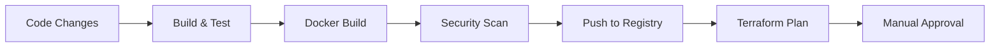

#### 2. Deploy Execution

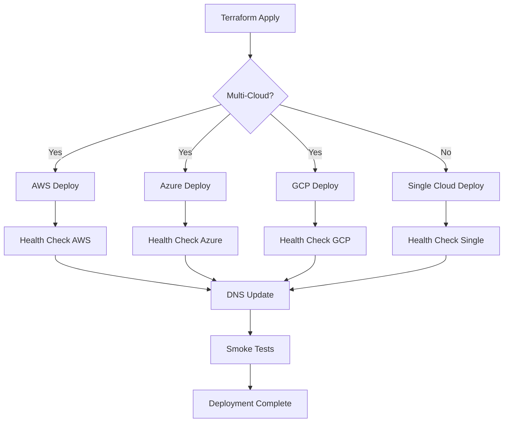

#### 3. Rollback Strategy

```bash
# Rollback automático em caso de falha
terraform apply -var="api_version=v0.9.0"  # Versão anterior

# Rollback manual
kubectl rollout undo deployment/freteapi-api  # Kubernetes
aws ecs update-service --force-new-deployment  # ECS
```

### Verificação de Deploy

```bash
# Health checks
curl https://api-aws.freteapi.com/health
curl https://api-azure.freteapi.com/health
curl https://api-gcp.freteapi.com/health

# Verificar versão
curl https://api-aws.freteapi.com/api/version

# Testes de integração
dotnet test FreteAPI.IntegrationTests --environment=production
```

### Estimativa de Custos

#### Desenvolvimento

| Provider | Serviço | Custo Mensal |
|----------|---------|--------------|
| **AWS** | ECS Fargate (1 task) | $15 |
| | RDS db.t3.micro | $15 |
| | ALB | $20 |
| | **Total AWS** | **$50** |
| **Azure** | Container Apps (0.25 vCPU) | $10 |
| | PostgreSQL B1ms | $20 |
| | Container Registry | $5 |
| | **Total Azure** | **$35** |
| **GCP** | Cloud Run (1 CPU) | $5 |
| | Cloud SQL db-f1-micro | $10 |
| | Artifact Registry | $2 |
| | **Total GCP** | **$17** |

#### Produção

| Provider | Serviço | Custo Mensal |
|----------|---------|--------------|
| **AWS** | ECS Fargate (3 tasks) | $90 |
| | RDS db.t3.small | $50 |
| | ALB + extras | $30 |
| | **Total AWS** | **$170** |
| **Azure** | Container Apps (1 vCPU) | $50 |
| | PostgreSQL GP_Standard_D2s_v3 | $120 |
| | Extras | $20 |
| | **Total Azure** | **$190** |
| **GCP** | Cloud Run (2 CPUs) | $30 |
| | Cloud SQL db-standard-2 | $80 |
| | Extras | $15 |
| | **Total GCP** | **$125** |

## 📊 Monitoramento e Observabilidade

### Estratégia de Monitoramento

A aplicação implementa uma abordagem de observabilidade em três pilares:

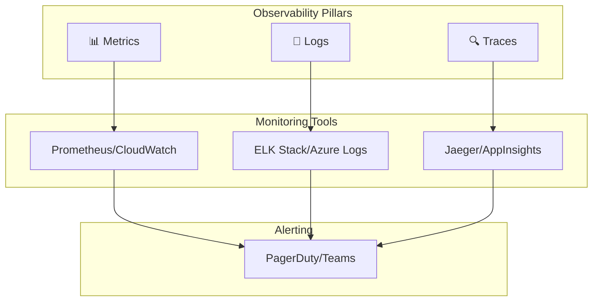

### Health Checks

#### Implementação de Health Checks

```csharp
// FreteAPI.API/Extensions/HealthCheckExtensions.cs
public static class HealthCheckExtensions
{
    public static IServiceCollection AddCustomHealthChecks(
        this IServiceCollection services,
        IConfiguration configuration)
    {
        services.AddHealthChecks()
            .AddNpgSql(
                connectionString: configuration.GetConnectionString("DefaultConnection"),
                name: "postgresql",
                tags: new[] { "database", "postgresql" })
            .AddDbContextCheck<FreteDbContext>(
                name: "dbcontext",
                tags: new[] { "database", "ef-core" })
            .AddCheck<ExternalServiceHealthCheck>(
                name: "external-service",
                tags: new[] { "external", "http" })
            .AddCheck<StorageHealthCheck>(
                name: "storage",
                tags: new[] { "storage", "files" });

        return services;
    }
}

// Health check customizado
public class ExternalServiceHealthCheck : IHealthCheck
{
    private readonly HttpClient _httpClient;
    private readonly ILogger<ExternalServiceHealthCheck> _logger;

    public async Task<HealthCheckResult> CheckHealthAsync(
        HealthCheckContext context,
        CancellationToken cancellationToken = default)
    {
        try
        {
            var response = await _httpClient.GetAsync("/health", cancellationToken);
            
            return response.IsSuccessStatusCode
                ? HealthCheckResult.Healthy("External service is healthy")
                : HealthCheckResult.Unhealthy($"External service returned {response.StatusCode}");
        }
        catch (Exception ex)
        {
            _logger.LogError(ex, "Health check failed for external service");
            return HealthCheckResult.Unhealthy("External service is unreachable", ex);
        }
    }
}
```

### Métricas Customizadas

```csharp
// FreteAPI.API/Metrics/ApplicationMetrics.cs
public class ApplicationMetrics
{
    private readonly Counter _requestsTotal;
    private readonly Histogram _requestDuration;
    private readonly Gauge _activeConnections;
    private readonly Counter _businessEvents;

    public ApplicationMetrics()
    {
        _requestsTotal = Metrics.CreateCounter(
            "freteapi_requests_total",
            "Total number of HTTP requests",
            new[] { "method", "endpoint", "status_code" });

        _requestDuration = Metrics.CreateHistogram(
            "freteapi_request_duration_seconds",
            "HTTP request duration in seconds",
            new[] { "method", "endpoint" });

        _activeConnections = Metrics.CreateGauge(
            "freteapi_active_connections",
            "Number of active database connections");

        _businessEvents = Metrics.CreateCounter(
            "freteapi_business_events_total",
            "Total number of business events",
            new[] { "event_type", "status" });
    }

    public void RecordRequest(string method, string endpoint, int statusCode, double duration)
    {
        _requestsTotal.WithLabels(method, endpoint, statusCode.ToString()).Inc();
        _requestDuration.WithLabels(method, endpoint).Observe(duration);
    }

    public void RecordBusinessEvent(string eventType, string status)
    {
        _businessEvents.WithLabels(eventType, status).Inc();
    }
}
```

### Logging Estruturado

```csharp
// FreteAPI.API/Middleware/StructuredLoggingMiddleware.cs
public class StructuredLoggingMiddleware
{
    private readonly RequestDelegate _next;
    private readonly ILogger<StructuredLoggingMiddleware> _logger;

    public async Task InvokeAsync(HttpContext context)
    {
        var correlationId = context.Request.Headers["X-Correlation-ID"].FirstOrDefault() 
                          ?? Guid.NewGuid().ToString();

        using (_logger.BeginScope(new Dictionary<string, object>
        {
            ["CorrelationId"] = correlationId,
            ["RequestPath"] = context.Request.Path,
            ["RequestMethod"] = context.Request.Method,
            ["UserAgent"] = context.Request.Headers["User-Agent"].ToString(),
            ["RemoteIp"] = context.Connection.RemoteIpAddress?.ToString()
        }))
        {
            context.Response.Headers.Add("X-Correlation-ID", correlationId);
            
            var stopwatch = Stopwatch.StartNew();
            
            try
            {
                await _next(context);
            }
            finally
            {
                stopwatch.Stop();
                
                _logger.LogInformation("HTTP {RequestMethod} {RequestPath} responded {StatusCode} in {Elapsed}ms",
                    context.Request.Method,
                    context.Request.Path,
                    context.Response.StatusCode,
                    stopwatch.ElapsedMilliseconds);
            }
        }
    }
}
```

### Alertas e Notificações

```yaml
# monitoring/alerts/freteapi-alerts.yml
groups:
  - name: freteapi-api
    rules:
      - alert: HighErrorRate
        expr: rate(freteapi_requests_total{status_code=~"5.."}[5m]) > 0.1
        for: 2m
        labels:
          severity: critical
        annotations:
          summary: "High error rate detected"
          description: "Error rate is {{ $value }} requests per second"

      - alert: HighResponseTime
        expr: histogram_quantile(0.95, freteapi_request_duration_seconds_bucket) > 2
        for: 3m
        labels:
          severity: warning
        annotations:
          summary: "High response time detected"
          description: "95th percentile response time is {{ $value }}s"

      - alert: DatabaseConnectionFailure
        expr: up{job="postgresql"} == 0
        for: 1m
        labels:
          severity: critical
        annotations:
          summary: "Database connection failed"
          description: "PostgreSQL database is unreachable"

      - alert: LowDiskSpace
        expr: node_filesystem_avail_bytes / node_filesystem_size_bytes < 0.1
        for: 5m
        labels:
          severity: warning
        annotations:
          summary: "Low disk space"
          description: "Disk usage is above 90%"
```

## 🔒 Segurança e Compliance

### Arquitetura de Segurança

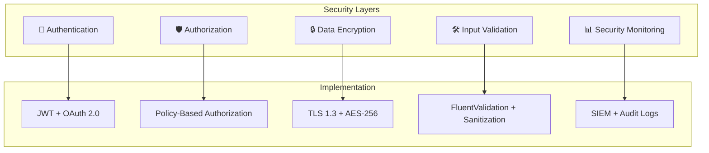

### Autenticação e Autorização

#### JWT Configuration

```csharp
// FreteAPI.API/Configuration/JwtConfiguration.cs
public class JwtConfiguration
{
    public string Key { get; set; } = string.Empty;
    public string Issuer { get; set; } = string.Empty;
    public string Audience { get; set; } = string.Empty;
    public int ExpireMinutes { get; set; } = 60;
    public int RefreshTokenExpireDays { get; set; } = 7;
    public bool RequireHttpsMetadata { get; set; } = true;
    public bool ValidateIssuerSigningKey { get; set; } = true;
    public bool ValidateIssuer { get; set; } = true;
    public bool ValidateAudience { get; set; } = true;
    public bool ValidateLifetime { get; set; } = true;
    public int ClockSkewMinutes { get; set; } = 5;
}

// Service Registration
services.AddAuthentication(options =>
{
    options.DefaultAuthenticateScheme = JwtBearerDefaults.AuthenticationScheme;
    options.DefaultChallengeScheme = JwtBearerDefaults.AuthenticationScheme;
})
.AddJwtBearer(options =>
{
    var jwtConfig = configuration.GetSection("JwtSettings").Get<JwtConfiguration>();
    
    options.TokenValidationParameters = new TokenValidationParameters
    {
        ValidateIssuerSigningKey = jwtConfig.ValidateIssuerSigningKey,
        IssuerSigningKey = new SymmetricSecurityKey(Encoding.UTF8.GetBytes(jwtConfig.Key)),
        ValidateIssuer = jwtConfig.ValidateIssuer,
        ValidIssuer = jwtConfig.Issuer,
        ValidateAudience = jwtConfig.ValidateAudience,
        ValidAudience = jwtConfig.Audience,
        ValidateLifetime = jwtConfig.ValidateLifetime,
        ClockSkew = TimeSpan.FromMinutes(jwtConfig.ClockSkewMinutes)
    };
});
```

#### Policy-Based Authorization

```csharp
// FreteAPI.API/Authorization/Policies.cs
public static class Policies
{
    public const string RequireClientRole = "RequireClientRole";
    public const string RequireProfessionalRole = "RequireProfessionalRole";
    public const string RequireAdminRole = "RequireAdminRole";
    public const string ManageOwnData = "ManageOwnData";
    public const string ViewReports = "ViewReports";
}

// Policy configuration
services.AddAuthorizationCore(options =>
{
    options.AddPolicy(Policies.RequireClientRole, policy =>
        policy.RequireRole("Cliente"));
        
    options.AddPolicy(Policies.RequireProfessionalRole, policy =>
        policy.RequireRole("Profissional"));
        
    options.AddPolicy(Policies.RequireAdminRole, policy =>
        policy.RequireRole("Admin"));
        
    options.AddPolicy(Policies.ManageOwnData, policy =>
        policy.Requirements.Add(new OwnDataRequirement()));
        
    options.AddPolicy(Policies.ViewReports, policy =>
        policy.Requirements.Add(new ReportAccessRequirement()));
});

// Custom Authorization Handler
public class OwnDataAuthorizationHandler : AuthorizationHandler<OwnDataRequirement>
{
    protected override Task HandleRequirementAsync(
        AuthorizationHandlerContext context,
        OwnDataRequirement requirement)
    {
        var userId = context.User.FindFirst(ClaimTypes.NameIdentifier)?.Value;
        var resourceUserId = context.Resource?.ToString();

        if (userId == resourceUserId || context.User.IsInRole("Admin"))
        {
            context.Succeed(requirement);
        }

        return Task.CompletedTask;
    }
}
```

### Criptografia e Proteção de Dados

#### Configuração de Criptografia

```csharp
// FreteAPI.Infrastructure/Services/EncryptionService.cs
public class EncryptionService : IEncryptionService
{
    private readonly byte[] _key;
    private readonly byte[] _iv;

    public EncryptionService(IConfiguration configuration)
    {
        var encryptionKey = configuration["Encryption:Key"] ?? 
            throw new InvalidOperationException("Encryption key not configured");
        _key = Convert.FromBase64String(encryptionKey);
        _iv = new byte[16]; // IV for AES
    }

    public async Task<string> EncryptAsync(string plainText)
    {
        using var aes = Aes.Create();
        aes.Key = _key;
        aes.IV = _iv;
        
        using var encryptor = aes.CreateEncryptor(aes.Key, aes.IV);
        using var msEncrypt = new MemoryStream();
        using var csEncrypt = new CryptoStream(msEncrypt, encryptor, CryptoStreamMode.Write);
        using var swEncrypt = new StreamWriter(csEncrypt);
        
        await swEncrypt.WriteAsync(plainText);
        var encrypted = msEncrypt.ToArray();
        
        return Convert.ToBase64String(encrypted);
    }

    public async Task<string> DecryptAsync(string cipherText)
    {
        var buffer = Convert.FromBase64String(cipherText);
        
        using var aes = Aes.Create();
        aes.Key = _key;
        aes.IV = _iv;
        
        using var decryptor = aes.CreateDecryptor(aes.Key, aes.IV);
        using var msDecrypt = new MemoryStream(buffer);
        using var csDecrypt = new CryptoStream(msDecrypt, decryptor, CryptoStreamMode.Read);
        using var srDecrypt = new StreamReader(csDecrypt);
        
        return await srDecrypt.ReadToEndAsync();
    }
}
```

### Segurança de Rede

#### Rate Limiting

```csharp
// FreteAPI.API/Middleware/RateLimitingMiddleware.cs
public class RateLimitingMiddleware
{
    private readonly RequestDelegate _next;
    private readonly IMemoryCache _cache;
    private readonly ILogger<RateLimitingMiddleware> _logger;
    private readonly RateLimitOptions _options;

    public async Task InvokeAsync(HttpContext context)
    {
        var key = GenerateKey(context);
        var requests = GetRequestCount(key);
        
        if (requests >= _options.MaxRequests)
        {
            context.Response.StatusCode = 429; // Too Many Requests
            context.Response.Headers.Add("Retry-After", _options.Window.TotalSeconds.ToString());
            
            _logger.LogWarning("Rate limit exceeded for {Key}", key);
            
            await context.Response.WriteAsync("Rate limit exceeded. Try again later.");
            return;
        }
        
        IncrementRequestCount(key);
        await _next(context);
    }
    
    private string GenerateKey(HttpContext context)
    {
        var userId = context.User?.Identity?.Name ?? "anonymous";
        var ipAddress = context.Connection.RemoteIpAddress?.ToString() ?? "unknown";
        
        return $"rate_limit:{userId}:{ipAddress}";
    }
}

// Configuration
services.Configure<RateLimitOptions>(options =>
{
    options.MaxRequests = 100; // requests
    options.Window = TimeSpan.FromMinutes(1); // per minute
});
```

#### CORS Configuration

```csharp
// FreteAPI.API/Configuration/CorsConfiguration.cs
services.AddCors(options =>
{
    options.AddDefaultPolicy(builder =>
    {
        builder
            .WithOrigins(
                "https://app.hoskentechnology.com.br",
                "https://freteapi.com.br",
                "https://localhost:3000") // Development
            .AllowAnyHeader()
            .AllowAnyMethod()
            .AllowCredentials()
            .SetIsOriginAllowedToAllowWildcardSubdomains();
    });
    
    options.AddPolicy("StrictPolicy", builder =>
    {
        builder
            .WithOrigins("https://app.hoskentechnology.com.br")
            .WithMethods("GET", "POST")
            .WithHeaders("Content-Type", "Authorization");
    });
});
```

### Auditoria e Compliance

#### Audit Trail

```csharp
// FreteAPI.Domain/Entities/AuditTrail.cs
public class AuditTrail : BaseEntity
{
    public string TableName { get; set; } = string.Empty;
    public string EntityId { get; set; } = string.Empty;
    public string Action { get; set; } = string.Empty; // INSERT, UPDATE, DELETE
    public string? OldValues { get; set; }
    public string? NewValues { get; set; }
    public string UserId { get; set; } = string.Empty;
    public string UserName { get; set; } = string.Empty;
    public string IpAddress { get; set; } = string.Empty;
    public DateTime Timestamp { get; set; } = DateTime.UtcNow;
}

// Audit Interceptor
public class AuditInterceptor : SaveChangesInterceptor
{
    private readonly ICurrentUserService _currentUserService;
    private readonly ILogger<AuditInterceptor> _logger;

    public override async ValueTask<InterceptionResult<int>> SavingChangesAsync(
        DbContextEventData eventData,
        InterceptionResult<int> result,
        CancellationToken cancellationToken = default)
    {
        if (eventData.Context is FreteDbContext context)
        {
            await CreateAuditEntries(context);
        }

        return await base.SavingChangesAsync(eventData, result, cancellationToken);
    }

    private async Task CreateAuditEntries(FreteDbContext context)
    {
        var auditEntries = new List<AuditTrail>();
        var currentUser = await _currentUserService.GetCurrentUserAsync();

        foreach (var entry in context.ChangeTracker.Entries())
        {
            if (entry.Entity is AuditTrail || entry.State == EntityState.Unchanged)
                continue;

            var auditTrail = new AuditTrail
            {
                TableName = entry.Entity.GetType().Name,
                EntityId = entry.Property("Id").CurrentValue?.ToString() ?? "",
                Action = entry.State.ToString(),
                UserId = currentUser?.Id ?? "System",
                UserName = currentUser?.Name ?? "System",
                IpAddress = _currentUserService.GetIpAddress() ?? "Unknown",
                OldValues = entry.State == EntityState.Modified 
                    ? JsonSerializer.Serialize(entry.OriginalValues.ToObject()) 
                    : null,
                NewValues = entry.State == EntityState.Added || entry.State == EntityState.Modified
                    ? JsonSerializer.Serialize(entry.CurrentValues.ToObject())
                    : null
            };

            auditEntries.Add(auditTrail);
        }

        await context.AuditTrails.AddRangeAsync(auditEntries);
    }
}
```

## 🧪 Testes e Qualidade

### Estratégia de Testes

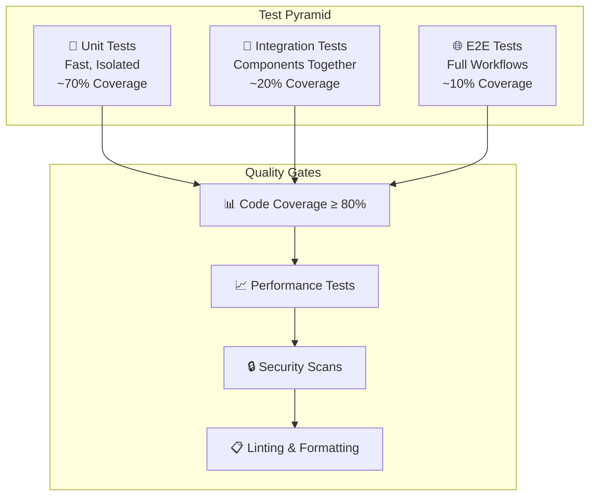

### Testes Unitários

#### Domain Layer Tests

```csharp
// FreteAPI.Tests.Unit/Domain/Entities/AgendamentoTests.cs
public class AgendamentoTests
{
    private readonly Cliente _cliente;
    private readonly Profissional _profissional;
    private readonly Endereco _enderecoOrigem;
    private readonly Endereco _enderecoDestino;

    public AgendamentoTests()
    {
        _cliente = ClienteBuilder.Default().Build();
        _profissional = ProfissionalBuilder.Default().Build();
        _enderecoOrigem = EnderecoBuilder.Default().Build();
        _enderecoDestino = EnderecoBuilder.Default().WithCep("01234-567").Build();
    }

    [Fact]
    public void CriarAgendamento_ComDadosValidos_DeveSerCriado()
    {
        // Arrange
        var dataAgendamento = DateTime.Now.AddDays(1);
        
        // Act
        var agendamento = Agendamento.Criar(
            _cliente.Id,
            _profissional.Id,
            dataAgendamento,
            "Mudança residencial",
            _enderecoOrigem,
            _enderecoDestino,
            1500.00m);

        // Assert
        agendamento.Should().NotBeNull();
        agendamento.ClienteId.Should().Be(_cliente.Id);
        agendamento.ProfissionalId.Should().Be(_profissional.Id);
        agendamento.DataAgendamento.Should().Be(dataAgendamento);
        agendamento.Status.Should().Be(StatusAgendamento.Agendado);
        agendamento.ValorOrcamento.Should().Be(1500.00m);
    }

    [Fact]
    public void ConfirmarAgendamento_ComStatusValido_DeveConfirmar()
    {
        // Arrange
        var agendamento = AgendamentoBuilder.Default()
            .WithStatus(StatusAgendamento.Agendado)
            .Build();
        
        // Act
        agendamento.Confirmar();
        
        // Assert
        agendamento.Status.Should().Be(StatusAgendamento.Confirmado);
        agendamento.DomainEvents.Should().ContainSingle(e => e is AgendamentoConfirmadoEvent);
    }

    [Theory]
    [InlineData(StatusAgendamento.Confirmado)]
    [InlineData(StatusAgendamento.Cancelado)]
    [InlineData(StatusAgendamento.Finalizado)]
    public void ConfirmarAgendamento_ComStatusInvalido_DeveLancarExcecao(StatusAgendamento status)
    {
        // Arrange
        var agendamento = AgendamentoBuilder.Default()
            .WithStatus(status)
            .Build();
        
        // Act & Assert
        var act = () => agendamento.Confirmar();
        
        act.Should().Throw<DomainException>()
            .WithMessage("*não pode ser confirmado*");
    }
}

// Test Builder Pattern
public class AgendamentoBuilder
{
    private Guid _clienteId = Guid.NewGuid();
    private Guid _profissionalId = Guid.NewGuid();
    private DateTime _dataAgendamento = DateTime.Now.AddDays(1);
    private string _descricao = "Teste";
    private Endereco _enderecoOrigem = EnderecoBuilder.Default().Build();
    private Endereco _enderecoDestino = EnderecoBuilder.Default().Build();
    private decimal _valorOrcamento = 100.00m;
    private StatusAgendamento _status = StatusAgendamento.Agendado;

    public static AgendamentoBuilder Default() => new();

    public AgendamentoBuilder WithClienteId(Guid clienteId)
    {
        _clienteId = clienteId;
        return this;
    }

    public AgendamentoBuilder WithStatus(StatusAgendamento status)
    {
        _status = status;
        return this;
    }

    public Agendamento Build()
    {
        var agendamento = Agendamento.Criar(
            _clienteId,
            _profissionalId,
            _dataAgendamento,
            _descricao,
            _enderecoOrigem,
            _enderecoDestino,
            _valorOrcamento);

        // Use reflection to set status if needed for testing
        if (_status != StatusAgendamento.Agendado)
        {
            var statusField = typeof(Agendamento).GetField("_status", 
                BindingFlags.NonPublic | BindingFlags.Instance);
            statusField?.SetValue(agendamento, _status);
        }

        return agendamento;
    }
}
```

#### Application Layer Tests

```csharp
// FreteAPI.Tests.Unit/Application/Commands/CriarAgendamentoCommandHandlerTests.cs
public class CriarAgendamentoCommandHandlerTests
{
    private readonly Mock<IAgendamentoRepository> _agendamentoRepositoryMock;
    private readonly Mock<IClienteRepository> _clienteRepositoryMock;
    private readonly Mock<IProfissionalRepository> _profissionalRepositoryMock;
    private readonly Mock<IUnitOfWork> _unitOfWorkMock;
    private readonly Mock<ILogger<CriarAgendamentoCommandHandler>> _loggerMock;
    private readonly CriarAgendamentoCommandHandler _handler;

    public CriarAgendamentoCommandHandlerTests()
    {
        _agendamentoRepositoryMock = new Mock<IAgendamentoRepository>();
        _clienteRepositoryMock = new Mock<IClienteRepository>();
        _profissionalRepositoryMock = new Mock<IProfissionalRepository>();
        _unitOfWorkMock = new Mock<IUnitOfWork>();
        _loggerMock = new Mock<ILogger<CriarAgendamentoCommandHandler>>();
        
        _handler = new CriarAgendamentoCommandHandler(
            _agendamentoRepositoryMock.Object,
            _clienteRepositoryMock.Object,
            _profissionalRepositoryMock.Object,
            _unitOfWorkMock.Object,
            _loggerMock.Object);
    }

    [Fact]
    public async Task Handle_ComComandoValido_DeveCriarAgendamento()
    {
        // Arrange
        var command = new CriarAgendamentoCommand
        {
            ClienteId = Guid.NewGuid(),
            ProfissionalId = Guid.NewGuid(),
            DataAgendamento = DateTime.Now.AddDays(1),
            Descricao = "Mudança residencial",
            EnderecoOrigem = new EnderecoDto 
            { 
                Logradouro = "Rua A",
                Numero = "123",
                Cep = "12345-678",
                Cidade = "São Paulo",
                Estado = "SP"
            },
            EnderecoDestino = new EnderecoDto 
            { 
                Logradouro = "Rua B", 
                Numero = "456",
                Cep = "87654-321",
                Cidade = "Rio de Janeiro",
                Estado = "RJ"
            },
            ValorOrcamento = 1500.00m
        };

        var cliente = ClienteBuilder.Default().WithId(command.ClienteId).Build();
        var profissional = ProfissionalBuilder.Default().WithId(command.ProfissionalId).Build();

        _clienteRepositoryMock
            .Setup(x => x.GetByIdAsync(command.ClienteId, It.IsAny<CancellationToken>()))
            .ReturnsAsync(cliente);
            
        _profissionalRepositoryMock
            .Setup(x => x.GetByIdAsync(command.ProfissionalId, It.IsAny<CancellationToken>()))
            .ReturnsAsync(profissional);

        // Act
        var result = await _handler.Handle(command, CancellationToken.None);

        // Assert
        result.Should().NotBeNull();
        result.Success.Should().BeTrue();
        result.Data.Should().NotBeEmpty();
        
        _agendamentoRepositoryMock.Verify(
            x => x.AddAsync(It.IsAny<Agendamento>(), It.IsAny<CancellationToken>()), 
            Times.Once);
        
        _unitOfWorkMock.Verify(
            x => x.SaveChangesAsync(It.IsAny<CancellationToken>()), 
            Times.Once);
    }

    [Fact]
    public async Task Handle_ComClienteInexistente_DeveRetornarErro()
    {
        // Arrange
        var command = new CriarAgendamentoCommand { ClienteId = Guid.NewGuid() };

        _clienteRepositoryMock
            .Setup(x => x.GetByIdAsync(command.ClienteId, It.IsAny<CancellationToken>()))
            .ReturnsAsync((Cliente)null);

        // Act
        var result = await _handler.Handle(command, CancellationToken.None);

        // Assert
        result.Success.Should().BeFalse();
        result.Error.Should().Be("Cliente não encontrado");
        
        _agendamentoRepositoryMock.Verify(
            x => x.AddAsync(It.IsAny<Agendamento>(), It.IsAny<CancellationToken>()), 
            Times.Never);
    }
}
```

### Testes de Integração

```csharp
// FreteAPI.Tests.Integration/Controllers/AgendamentosControllerTests.cs
public class AgendamentosControllerTests : IClassFixture<WebApplicationFactory<Program>>
{
    private readonly WebApplicationFactory<Program> _factory;
    private readonly HttpClient _client;

    public AgendamentosControllerTests(WebApplicationFactory<Program> factory)
    {
        _factory = factory.WithWebHostBuilder(builder =>
        {
            builder.UseEnvironment("Testing");
            builder.ConfigureServices(services =>
            {
                // Replace database with in-memory database
                var descriptor = services.SingleOrDefault(
                    d => d.ServiceType == typeof(DbContextOptions<FreteDbContext>));
                
                if (descriptor != null)
                    services.Remove(descriptor);

                services.AddDbContext<FreteDbContext>(options =>
                {
                    options.UseInMemoryDatabase("InMemoryDbForTesting");
                });

                var sp = services.BuildServiceProvider();
                using var scope = sp.CreateScope();
                var context = scope.ServiceProvider.GetRequiredService<FreteDbContext>();
                
                context.Database.EnsureCreated();
                SeedTestData(context);
            });
        });

        _client = _factory.CreateClient();
    }

    [Fact]
    public async Task GetAgendamentos_SemFiltros_DeveRetornarListaPaginada()
    {
        // Arrange
        var token = await GetAuthTokenAsync();
        _client.DefaultRequestHeaders.Authorization = new AuthenticationHeaderValue("Bearer", token);

        // Act
        var response = await _client.GetAsync("/api/v1/agendamentos?page=1&pageSize=10");

        // Assert
        response.StatusCode.Should().Be(HttpStatusCode.OK);
        
        var content = await response.Content.ReadAsStringAsync();
        var result = JsonSerializer.Deserialize<PagedResult<AgendamentoDto>>(content, new JsonSerializerOptions
        {
            PropertyNameCaseInsensitive = true
        });

        result.Should().NotBeNull();
        result.Data.Should().NotBeEmpty();
        result.TotalCount.Should().BeGreaterThan(0);
    }

    [Fact]
    public async Task CreateAgendamento_ComDadosValidos_DeveRetornar201()
    {
        // Arrange
        var token = await GetAuthTokenAsync();
        _client.DefaultRequestHeaders.Authorization = new AuthenticationHeaderValue("Bearer", token);

        var command = new CriarAgendamentoCommand
        {
            ClienteId = Guid.Parse("11111111-1111-1111-1111-111111111111"), // From seed data
            ProfissionalId = Guid.Parse("22222222-2222-2222-2222-222222222222"), // From seed data
            DataAgendamento = DateTime.Now.AddDays(1),
            Descricao = "Teste de integração",
            EnderecoOrigem = new EnderecoDto
            {
                Logradouro = "Rua Teste",
                Numero = "123",
                Cep = "01234-567",
                Cidade = "São Paulo",
                Estado = "SP"
            },
            EnderecoDestino = new EnderecoDto
            {
                Logradouro = "Av Teste",
                Numero = "456",
                Cep = "87654-321",
                Cidade = "Rio de Janeiro",
                Estado = "RJ"
            },
            ValorOrcamento = 1200.00m
        };

        var json = JsonSerializer.Serialize(command);
        var content = new StringContent(json, Encoding.UTF8, "application/json");

        // Act
        var response = await _client.PostAsync("/api/v1/agendamentos", content);

        // Assert
        response.StatusCode.Should().Be(HttpStatusCode.Created);
        
        var responseContent = await response.Content.ReadAsStringAsync();
        var result = JsonSerializer.Deserialize<Result<Guid>>(responseContent, new JsonSerializerOptions
        {
            PropertyNameCaseInsensitive = true
        });

        result.Should().NotBeNull();
        result.Success.Should().BeTrue();
        result.Data.Should().NotBeEmpty();
    }

    private async Task<string> GetAuthTokenAsync()
    {
        var loginRequest = new
        {
            Email = "test@example.com",
            Password = "Test123!"
        };

        var json = JsonSerializer.Serialize(loginRequest);
        var content = new StringContent(json, Encoding.UTF8, "application/json");

        var response = await _client.PostAsync("/api/v1/auth/login", content);
        var responseContent = await response.Content.ReadAsStringAsync();
        
        var loginResult = JsonSerializer.Deserialize<JsonElement>(responseContent);
        return loginResult.GetProperty("token").GetString() ?? string.Empty;
    }

    private static void SeedTestData(FreteDbContext context)
    {
        // Seed test data for integration tests
        var cliente = new Cliente(
            Guid.Parse("11111111-1111-1111-1111-111111111111"),
            "Cliente Teste",
            new Email("cliente@test.com"),
            new Telefone("11999999999"));

        var profissional = new Profissional(
            Guid.Parse("22222222-2222-2222-2222-222222222222"),
            "Profissional Teste",
            new Email("profissional@test.com"),
            new Telefone("11888888888"),
            "Mudanças e Transportes");

        context.Clientes.Add(cliente);
        context.Profissionais.Add(profissional);
        context.SaveChanges();
    }
}
```

### Testes de Performance

```csharp
// FreteAPI.Tests.Performance/LoadTests.cs
[MemoryDiagnoser]
[SimpleJob(RuntimeMoniker.Net80)]
public class AgendamentoApiLoadTests
{
    private HttpClient _client = null!;
    private string _authToken = null!;

    [GlobalSetup]
    public async Task Setup()
    {
        var factory = new WebApplicationFactory<Program>();
        _client = factory.CreateClient();
        _authToken = await GetAuthTokenAsync();
        _client.DefaultRequestHeaders.Authorization = new AuthenticationHeaderValue("Bearer", _authToken);
    }

    [Benchmark]
    public async Task GetAgendamentos_Concurrent_100Requests()
    {
        var tasks = Enumerable.Range(0, 100)
            .Select(_ => _client.GetAsync("/api/v1/agendamentos?page=1&pageSize=10"))
            .ToArray();

        await Task.WhenAll(tasks);

        foreach (var task in tasks)
        {
            var response = await task;
            response.EnsureSuccessStatusCode();
        }
    }

    [Benchmark]
    public async Task CreateAgendamento_Sequential_10Requests()
    {
        for (int i = 0; i < 10; i++)
        {
            var command = CreateTestCommand();
            var json = JsonSerializer.Serialize(command);
            var content = new StringContent(json, Encoding.UTF8, "application/json");

            var response = await _client.PostAsync("/api/v1/agendamentos", content);
            response.EnsureSuccessStatusCode();
        }
    }

    private CriarAgendamentoCommand CreateTestCommand()
    {
        return new CriarAgendamentoCommand
        {
            ClienteId = Guid.NewGuid(),
            ProfissionalId = Guid.NewGuid(),
            DataAgendamento = DateTime.Now.AddDays(1),
            Descricao = $"Performance test {Guid.NewGuid()}",
            EnderecoOrigem = new EnderecoDto
            {
                Logradouro = "Rua Performance",
                Numero = "123",
                Cep = "01234-567",
                Cidade = "São Paulo",
                Estado = "SP"
            },
            EnderecoDestino = new EnderecoDto
            {
                Logradouro = "Av Performance",
                Numero = "456",
                Cep = "87654-321",
                Cidade = "Rio de Janeiro",
                Estado = "RJ"
            },
            ValorOrcamento = 1000.00m
        };
    }
}
```

### Pipeline de Qualidade

```yaml
# .github/workflows/quality-gate.yml
name: Quality Gate

on:
  pull_request:
    branches: [main, develop]
  push:
    branches: [main, develop]

jobs:
  tests:
    name: Tests & Quality Checks
    runs-on: ubuntu-latest
    
    services:
      postgres:
        image: postgres:15
        env:
          POSTGRES_DB: freteapi_test
          POSTGRES_USER: test
          POSTGRES_PASSWORD: test123
        options: >-
          --health-cmd pg_isready
          --health-interval 10s
          --health-timeout 5s
          --health-retries 5
        ports:
          - 5432:5432

    steps:
    - uses: actions/checkout@v4
    
    - name: Setup .NET
      uses: actions/setup-dotnet@v3
      with:
        dotnet-version: '8.0.x'
    
    - name: Restore dependencies
      run: dotnet restore
    
    - name: Build
      run: dotnet build --no-restore --configuration Release
    
    - name: Unit Tests
      run: |
        dotnet test FreteAPI.Tests.Unit \
          --no-build \
          --configuration Release \
          --logger trx \
          --collect:"XPlat Code Coverage" \
          --results-directory ./TestResults/UnitTests
    
    - name: Integration Tests
      run: |
        dotnet test FreteAPI.Tests.Integration \
          --no-build \
          --configuration Release \
          --logger trx \
          --collect:"XPlat Code Coverage" \
          --results-directory ./TestResults/IntegrationTests
      env:
        ConnectionStrings__DefaultConnection: "Host=localhost;Database=freteapi_test;Username=test;Password=test123"
    
    - name: Generate Code Coverage Report
      run: |
        dotnet tool install -g dotnet-reportgenerator-globaltool
        reportgenerator \
          -reports:"TestResults/**/coverage.cobertura.xml" \
          -targetdir:"coveragereport" \
          -reporttypes:"Html;Cobertura;JsonSummary"
    
    - name: Code Coverage Quality Gate
      run: |
        COVERAGE=$(grep -oP '(?<=line-rate=")[^"]*' coveragereport/Cobertura.xml | head -1)
        COVERAGE_PERCENT=$(echo "$COVERAGE * 100" | bc -l | cut -d'.' -f1)
        echo "Code Coverage: $COVERAGE_PERCENT%"
        
        if (( $(echo "$COVERAGE_PERCENT < 80" | bc -l) )); then
          echo "❌ Code coverage ($COVERAGE_PERCENT%) is below 80% threshold"
          exit 1
        else
          echo "✅ Code coverage ($COVERAGE_PERCENT%) meets 80% threshold"
        fi
    
    - name: Security Scan
      run: |
        dotnet list package --vulnerable --include-transitive 2>&1 | tee security-scan.log
        if grep -q "has the following vulnerable packages" security-scan.log; then
          echo "❌ Vulnerable packages found"
          exit 1
        else
          echo "✅ No vulnerable packages found"
        fi
    
    - name: Code Analysis
      run: |
        dotnet format --verify-no-changes --verbosity diagnostic
        dotnet tool install -g dotnet-outdated-tool
        dotnet outdated --fail-on-updates
    
    - name: Upload Coverage Reports
      uses: codecov/codecov-action@v3
      with:
        files: ./coveragereport/Cobertura.xml
        fail_ci_if_error: true

  performance-tests:
    name: Performance Tests
    runs-on: ubuntu-latest
    needs: tests
    if: github.event_name == 'push' && github.ref == 'refs/heads/main'
    
    steps:
    - uses: actions/checkout@v4
    
    - name: Setup .NET
      uses: actions/setup-dotnet@v3
      with:
        dotnet-version: '8.0.x'
    
    - name: Run Performance Tests
      run: |
        dotnet run --project FreteAPI.Tests.Performance \
          --configuration Release \
          --framework net8.0 \
          -- --job short --exporters json html
    
    - name: Upload Performance Results
      uses: actions/upload-artifact@v3
      with:
        name: performance-results
        path: BenchmarkDotNet.Artifacts/
```

## 📚 Documentação da API

### OpenAPI/Swagger

A API é totalmente documentada usando OpenAPI 3.0 com Swagger UI integrado.

#### Configuração do Swagger

```csharp
// FreteAPI.API/Configuration/SwaggerConfiguration.cs
public static class SwaggerConfiguration
{
    public static IServiceCollection AddSwaggerDocumentation(this IServiceCollection services)
    {
        services.AddSwaggerGen(c =>
        {
            c.SwaggerDoc("v1", new OpenApiInfo
            {
                Title = "FreteAPI - Sistema de Agendamento de Frete",
                Version = "v1",
                Description = @"
                    API REST completa para gerenciamento de agendamentos de frete e mudanças.
                    
                    **Características:**
                    - Clean Architecture com DDD
                    - Autenticação JWT
                    - Rate Limiting
                    - Health Checks
                    - Documentação OpenAPI 3.0
                    
                    **Desenvolvido por:** Hosken Technology
                    **Licenciado para:** Hosken Technology",
                Contact = new OpenApiContact
                {
                    Name = "Hosken Technology",
                    Email = "contato@hoskentechnology.com.br",
                    Url = new Uri("https://hoskentechnology.com.br")
                },
                License = new OpenApiLicense
                {
                    Name = "Proprietary License - Hosken Technology",
                    Url = new Uri("https://hoskentechnology.com.br/license")
                }
            });

            // JWT Security Definition
            c.AddSecurityDefinition("Bearer", new OpenApiSecurityScheme
            {
                Description = @"JWT Authorization header using the Bearer scheme.
                              Enter 'Bearer' [space] and then your token in the text input below.
                              Example: 'Bearer 12345abcdef'",
                Name = "Authorization",
                In = ParameterLocation.Header,
                Type = SecuritySchemeType.ApiKey,
                Scheme = "Bearer"
            });

            c.AddSecurityRequirement(new OpenApiSecurityRequirement
            {
                {
                    new OpenApiSecurityScheme
                    {
                        Reference = new OpenApiReference
                        {
                            Type = ReferenceType.SecurityScheme,
                            Id = "Bearer"
                        },
                        Scheme = "oauth2",
                        Name = "Bearer",
                        In = ParameterLocation.Header,
                    },
                    new List<string>()
                }
            });

            // Include XML comments
            var xmlFile = $"{Assembly.GetExecutingAssembly().GetName().Name}.xml";
            var xmlPath = Path.Combine(AppContext.BaseDirectory, xmlFile);
            c.IncludeXmlComments(xmlPath);

            // Examples
            c.EnableAnnotations();
            c.ExampleFilters();
        });

        services.AddSwaggerExamplesFromAssemblyOf<CriarAgendamentoCommandExample>();
        
        return services;
    }

    public static IApplicationBuilder UseSwaggerDocumentation(this IApplicationBuilder app)
    {
        app.UseSwagger(c =>
        {
            c.RouteTemplate = "api/docs/{documentName}/swagger.json";
        });
        
        app.UseSwaggerUI(c =>
        {
            c.SwaggerEndpoint("/api/docs/v1/swagger.json", "FreteAPI v1");
            c.RoutePrefix = "api/docs";
            c.DocumentTitle = "FreteAPI - Documentação";
            c.DocExpansion(DocExpansion.List);
            c.DisplayRequestDuration();
            c.EnableDeepLinking();
            c.EnableFilter();
            c.ShowExtensions();
            c.EnableValidator();
        });

        return app;
    }
}
```

### Exemplos de Request/Response

```csharp
// FreteAPI.API/Examples/CriarAgendamentoCommandExample.cs
public class CriarAgendamentoCommandExample : IExamplesProvider<CriarAgendamentoCommand>
{
    public CriarAgendamentoCommand GetExamples()
    {
        return new CriarAgendamentoCommand
        {
            ClienteId = Guid.Parse("12345678-1234-1234-1234-123456789012"),
            ProfissionalId = Guid.Parse("87654321-4321-4321-4321-210987654321"),
            DataAgendamento = DateTime.Now.AddDays(3),
            Descricao = "Mudança residencial completa - Casa 3 quartos",
            EnderecoOrigem = new EnderecoDto
            {
                Logradouro = "Rua das Flores",
                Numero = "123",
                Complemento = "Apt 45",
                Bairro = "Jardim das Acácias",
                Cidade = "São Paulo",
                Estado = "SP",
                Cep = "01234-567"
            },
            EnderecoDestino = new EnderecoDto
            {
                Logradouro = "Avenida Paulista",
                Numero = "1000",
                Complemento = "Conj 12",
                Bairro = "Bela Vista",
                Cidade = "São Paulo",
                Estado = "SP",
                Cep = "01310-100"
            },
            ValorOrcamento = 2500.00m,
            Observacoes = "Possui piano e objetos frágeis. Necessário cuidado especial."
        };
    }
}
```

### Postman Collection

A API inclui uma collection do Postman completa com todos os endpoints:

```json
{
  "info": {
    "name": "FreteAPI - Complete Collection",
    "description": "Collection completa da API de Agendamento de Frete",
    "version": "1.0.0"
  },
  "auth": {
    "type": "bearer",
    "bearer": [
      {
        "key": "token",
        "value": "{{jwt_token}}",
        "type": "string"
      }
    ]
  },
  "item": [
    {
      "name": "Authentication",
      "item": [
        {
          "name": "Login",
          "request": {
            "method": "POST",
            "header": [
              {
                "key": "Content-Type",
                "value": "application/json"
              }
            ],
            "body": {
              "mode": "raw",
              "raw": "{\n  \"email\": \"usuario@exemplo.com\",\n  \"password\": \"MinhaSenh@123\"\n}"
            },
            "url": {
              "raw": "{{baseUrl}}/api/v1/auth/login",
              "host": ["{{baseUrl}}"],
              "path": ["api", "v1", "auth", "login"]
            }
          },
          "response": []
        }
      ]
    },
    {
      "name": "Agendamentos",
      "item": [
        {
          "name": "Listar Agendamentos",
          "request": {
            "method": "GET",
            "header": [],
            "url": {
              "raw": "{{baseUrl}}/api/v1/agendamentos?page=1&pageSize=10",
              "host": ["{{baseUrl}}"],
              "path": ["api", "v1", "agendamentos"],
              "query": [
                {
                  "key": "page",
                  "value": "1"
                },
                {
                  "key": "pageSize", 
                  "value": "10"
                }
              ]
            }
          }
        }
      ]
    }
  ],
  "variable": [
    {
      "key": "baseUrl",
      "value": "https://localhost:5001"
    },
    {
      "key": "jwt_token",
      "value": ""
    }
  ]
}
```

---

## 📄 Licença e Atribuição

### Licença Proprietária

**© 2024 Hosken Technology. Todos os direitos reservados.**

Este projeto foi desenvolvido por **Hosken Technology** e está licenciado sob uma licença proprietária. O uso, modificação, distribuição ou qualquer forma de exploração comercial deste software requer autorização expressa da Hosken Technology.

### Desenvolvedor Principal

- **Nome:** Hosken Gadu
- **GitHub:** [@hoskengadu](https://github.com/hoskengadu)
- **LinkedIn:** [Hosken Gadu](https://linkedin.com/in/hoskengadu)
- **Email:** hosken.gadu@hoskentechnology.com.br

### Empresa

- **Razão Social:** Hosken Technology LTDA
- **Website:** [https://hoskentechnology.com.br](https://hoskentechnology.com.br)
- **Email:** contato@hoskentechnology.com.br
- **Telefone:** +55 (11) 99999-9999

### Termos de Uso

1. **Propriedade Intelectual:** Todo o código, documentação e recursos associados são propriedade exclusiva da Hosken Technology.

2. **Uso Autorizado:** O uso deste software é permitido apenas para fins demonstrativos e educacionais, salvo autorização expressa.

3. **Modificações:** Qualquer modificação do código original deve manter as atribuições de copyright e licenciamento.

4. **Distribuição:** A redistribuição do software, em parte ou na íntegra, requer autorização prévia da Hosken Technology.

5. **Garantia:** O software é fornecido "como está", sem garantias de qualquer tipo.

### Contato para Licenciamento

Para questões sobre licenciamento comercial, parcerias ou uso empresarial:

📧 **licensing@hoskentechnology.com.br**  
📱 **+55 (11) 99999-9999**  
🌐 **[https://hoskentechnology.com.br/licensing](https://hoskentechnology.com.br/licensing)**

---

**Desenvolvido com ❤️ por Hosken Technology**

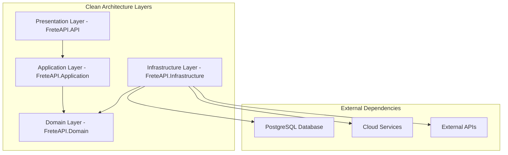

### Camadas da Arquitetura

#### 1. **Domain Layer** (`FreteAPI.Domain`)
**Responsabilidade**: Contém as regras de negócio centrais e entidades do domínio

```
Domain/
├── Entities/           # Entidades do domínio
│   ├── Cliente.cs     # Agregado Cliente
│   ├── Profissional.cs # Agregado Profissional  
│   ├── Disponibilidade.cs
│   └── Agendamento.cs # Agregado Agendamento
├── ValueObjects/      # Objetos de valor
│   ├── Email.cs
│   ├── Telefone.cs
│   ├── Endereco.cs
│   └── Periodo.cs
├── Enums/            # Enumerações do domínio
│   ├── StatusAgendamento.cs
│   ├── TipoServico.cs
│   └── DiaSemana.cs
├── Events/           # Eventos do domínio
│   ├── AgendamentoCriado.cs
│   ├── AgendamentoCancelado.cs
│   └── DisponibilidadeAlterada.cs
├── Exceptions/       # Exceções específicas do domínio
│   ├── DomainException.cs
│   ├── AgendamentoInvalidoException.cs
│   └── ClienteNaoEncontradoException.cs
└── Repositories/     # Contratos dos repositórios
    ├── IClienteRepository.cs
    ├── IProfissionalRepository.cs
    └── IAgendamentoRepository.cs
```

**Principais Entidades:**

```csharp
public class Cliente : Entity
{
    public string Nome { get; private set; }
    public Email Email { get; private set; }
    public Telefone Telefone { get; private set; }
    public Endereco Endereco { get; private set; }
    public List<Agendamento> Agendamentos { get; private set; }
    
    // Métodos de domínio
    public void AtualizarDados(string nome, Email email)
    public bool PodeAgendar(DateTime dataHora)
}
```

#### 2. **Application Layer** (`FreteAPI.Application`)
**Responsabilidade**: Orquestra as operações de negócio e casos de uso

```
Application/
├── Commands/         # Comandos CQRS
│   ├── Clientes/
│   │   ├── CriarClienteCommand.cs
│   │   ├── AtualizarClienteCommand.cs
│   │   └── CriarClienteCommandHandler.cs
│   ├── Agendamentos/
│   │   ├── CriarAgendamentoCommand.cs
│   │   ├── CancelarAgendamentoCommand.cs
│   │   └── CriarAgendamentoCommandHandler.cs
├── Queries/          # Consultas CQRS
│   ├── Clientes/
│   │   ├── ObterClienteQuery.cs
│   │   ├── ListarClientesQuery.cs
│   │   └── ObterClienteQueryHandler.cs
│   ├── Agendamentos/
│   │   ├── ObterAgendamentoQuery.cs
│   │   └── ListarAgendamentosQuery.cs
├── DTOs/            # Objetos de transferência de dados
│   ├── ClienteDto.cs
│   ├── AgendamentoDto.cs
│   └── DisponibilidadeDto.cs
├── Mappings/        # Mapeamentos AutoMapper
│   ├── ClienteProfile.cs
│   ├── AgendamentoProfile.cs
│   └── DisponibilidadeProfile.cs
├── Services/        # Serviços de aplicação
│   ├── IClienteService.cs
│   ├── ClienteService.cs
│   ├── IAgendamentoService.cs
│   └── AgendamentoService.cs
├── Validators/      # Validações FluentValidation
│   ├── CriarClienteCommandValidator.cs
│   ├── CriarAgendamentoCommandValidator.cs
│   └── AtualizarDisponibilidadeCommandValidator.cs
├── Behaviors/       # Comportamentos MediatR
│   ├── ValidationBehavior.cs
│   ├── LoggingBehavior.cs
│   └── PerformanceBehavior.cs
└── Interfaces/      # Contratos de serviços externos
    ├── IEmailService.cs
    ├── INotificationService.cs
    └── ICacheService.cs
```

#### 3. **Infrastructure Layer** (`FreteAPI.Infrastructure`)
**Responsabilidade**: Implementação de detalhes técnicos e integrações externas

```
Infrastructure/
├── Data/            # Configurações Entity Framework
│   ├── FreteDbContext.cs
│   ├── Configurations/
│   │   ├── ClienteConfiguration.cs
│   │   ├── ProfissionalConfiguration.cs
│   │   ├── AgendamentoConfiguration.cs
│   │   └── DisponibilidadeConfiguration.cs
│   ├── Migrations/  # Migrações do banco
│   ├── Repositories/ # Implementações dos repositórios
│   │   ├── ClienteRepository.cs
│   │   ├── ProfissionalRepository.cs
│   │   ├── AgendamentoRepository.cs
│   │   └── BaseRepository.cs
│   └── UnitOfWork/
│       ├── IUnitOfWork.cs
│       └── UnitOfWork.cs
├── Services/        # Implementações de serviços
│   ├── EmailService.cs
│   ├── NotificationService.cs
│   ├── CacheService.cs
│   └── CloudStorageService.cs
├── External/        # Integrações externas
│   ├── PaymentGateway/
│   ├── SMSProvider/
│   └── GeolocationService/
└── Configuration/   # Configurações de infraestrutura
    ├── DatabaseConfiguration.cs
    ├── CacheConfiguration.cs
    └── ServicesConfiguration.cs
```

#### 4. **Presentation Layer** (`FreteAPI.API`)
**Responsabilidade**: Interface de apresentação e controladores da API

```
API/
├── Controllers/     # Controladores da API
│   ├── ClientesController.cs
│   ├── ProfissionaisController.cs
│   ├── AgendamentosController.cs
│   ├── DisponibilidadesController.cs
│   └── BaseController.cs
├── Middlewares/     # Middlewares personalizados
│   ├── ExceptionHandlingMiddleware.cs
│   ├── RequestLoggingMiddleware.cs
│   ├── RateLimitingMiddleware.cs
│   └── AuthenticationMiddleware.cs
├── Filters/         # Filtros de ação
│   ├── ValidationFilter.cs
│   ├── AuthorizationFilter.cs
│   └── CacheFilter.cs
├── Extensions/      # Métodos de extensão
│   ├── ServiceCollectionExtensions.cs
│   ├── ApplicationBuilderExtensions.cs
│   └── ConfigurationExtensions.cs
├── Configuration/   # Configurações da API
│   ├── SwaggerConfiguration.cs
│   ├── CorsConfiguration.cs
│   ├── AuthenticationConfiguration.cs
│   └── ApiVersioningConfiguration.cs
├── Models/          # Modelos de requisição/resposta
│   ├── Requests/
│   │   ├── CriarClienteRequest.cs
│   │   ├── AtualizarClienteRequest.cs
│   │   └── CriarAgendamentoRequest.cs
│   ├── Responses/
│   │   ├── ClienteResponse.cs
│   │   ├── AgendamentoResponse.cs
│   │   └── ApiResponse.cs
│   └── ViewModels/
│       ├── ClienteViewModel.cs
│       └── AgendamentoViewModel.cs
└── Health/          # Health checks
    ├── DatabaseHealthCheck.cs
    ├── ExternalServiceHealthCheck.cs
    └── MemoryHealthCheck.cs
```

## 🎨 Domain-Driven Design (DDD)

### Conceitos DDD Implementados

#### 1. **Bounded Contexts**
A aplicação está organizada em contextos delimitados:

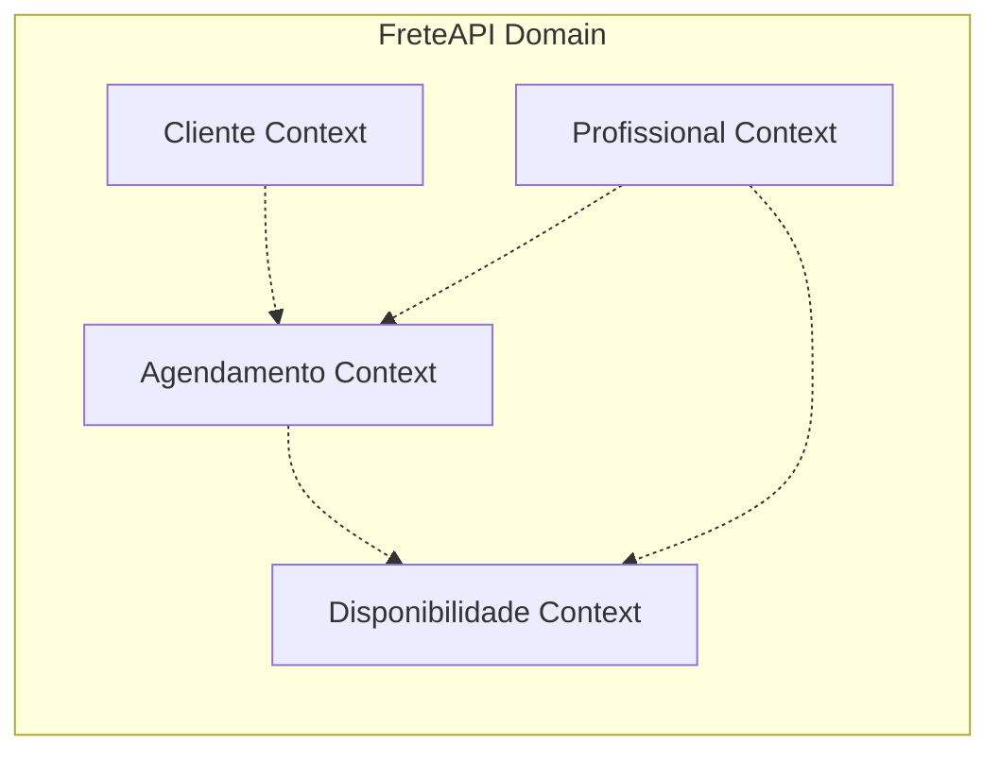

#### 2. **Aggregates**
Cada agregado mantém consistência transacional:

```csharp
public class Agendamento : AggregateRoot
{
    public AgendamentoId Id { get; private set; }
    public ClienteId ClienteId { get; private set; }
    public ProfissionalId ProfissionalId { get; private set; }
    public DateTime DataHora { get; private set; }
    public StatusAgendamento Status { get; private set; }
    public TipoServico TipoServico { get; private set; }
    
    // Invariantes do negócio
    public void Confirmar()
    {
        if (Status != StatusAgendamento.Pendente)
            throw new InvalidOperationException("Apenas agendamentos pendentes podem ser confirmados");
            
        Status = StatusAgendamento.Confirmado;
        AddDomainEvent(new AgendamentoConfirmadoEvent(Id));
    }
}
```

#### 3. **Value Objects**
Objetos de valor garantem imutabilidade e validação:

```csharp
public class Email : ValueObject
{
    public string Value { get; private set; }
    
    private Email(string value)
    {
        if (!IsValidEmail(value))
            throw new ArgumentException("Email inválido", nameof(value));
            
        Value = value;
    }
    
    public static Email Create(string value) => new(value);
    
    protected override IEnumerable<object> GetEqualityComponents()
    {
        yield return Value;
    }
}
```

#### 4. **Domain Events**
Eventos de domínio para comunicação entre agregados:

```csharp
public class AgendamentoCriadoEvent : DomainEvent
{
    public AgendamentoCriadoEvent(AgendamentoId agendamentoId, ClienteId clienteId)
    {
        AgendamentoId = agendamentoId;
        ClienteId = clienteId;
    }
    
    public AgendamentoId AgendamentoId { get; }
    public ClienteId ClienteId { get; }
}

public class AgendamentoCriadoEventHandler : INotificationHandler<AgendamentoCriadoEvent>
{
    public async Task Handle(AgendamentoCriadoEvent notification, CancellationToken cancellationToken)
    {
        // Enviar email de confirmação
        // Atualizar disponibilidade do profissional
        // Registrar log de auditoria
    }
}
```

#### 5. **Repository Pattern**
Repositórios focados no agregado:

```csharp
public interface IAgendamentoRepository : IRepository<Agendamento>
{
    Task<Agendamento> ObterPorIdAsync(AgendamentoId id);
    Task<IEnumerable<Agendamento>> ObterPorClienteAsync(ClienteId clienteId);
    Task<IEnumerable<Agendamento>> ObterPorProfissionalAsync(ProfissionalId profissionalId);
    Task<IEnumerable<Agendamento>> ObterPorPeriodoAsync(DateTime inicio, DateTime fim);
    Task<bool> ExisteConflitoPorPeriodoAsync(ProfissionalId profissionalId, DateTime inicio, DateTime fim);
}
```

## 🧹 Clean Architecture

### Princípios Aplicados

#### 1. **Dependency Inversion**
Dependências sempre apontam para dentro:

```csharp
// Application Layer
public class CriarAgendamentoCommandHandler : IRequestHandler<CriarAgendamentoCommand, AgendamentoDto>
{
    private readonly IAgendamentoRepository _repository;
    private readonly IClienteRepository _clienteRepository; 
    private readonly IUnitOfWork _unitOfWork;
    
    // Dependências injetadas via DI Container
    public CriarAgendamentoCommandHandler(
        IAgendamentoRepository repository,
        IClienteRepository clienteRepository,
        IUnitOfWork unitOfWork)
    {
        _repository = repository;
        _clienteRepository = clienteRepository;
        _unitOfWork = unitOfWork;
    }
}
```

#### 2. **CQRS (Command Query Responsibility Segregation)**
Separação clara entre comandos e consultas:

```csharp
// Command
public class CriarClienteCommand : IRequest<ClienteDto>
{
    public string Nome { get; set; }
    public string Email { get; set; }
    public string Telefone { get; set; }
    public EnderecoDto Endereco { get; set; }
}

// Query  
public class ObterClienteQuery : IRequest<ClienteDto>
{
    public Guid ClienteId { get; set; }
}
```

#### 3. **Single Responsibility Principle**
Cada classe tem uma única responsabilidade:

```csharp
// Responsável apenas por validar comandos de criação de cliente
public class CriarClienteCommandValidator : AbstractValidator<CriarClienteCommand>
{
    public CriarClienteCommandValidator()
    {
        RuleFor(x => x.Nome)
            .NotEmpty().WithMessage("Nome é obrigatório")
            .MaximumLength(200).WithMessage("Nome deve ter no máximo 200 caracteres");
            
        RuleFor(x => x.Email)
            .NotEmpty().WithMessage("Email é obrigatório")
            .EmailAddress().WithMessage("Email deve ter formato válido");
    }
}
```

#### 4. **Open/Closed Principle**
Extensível sem modificação:

```csharp
public abstract class NotificationService
{
    public abstract Task EnviarAsync(string destinatario, string mensagem);
}

public class EmailNotificationService : NotificationService
{
    public override async Task EnviarAsync(string destinatario, string mensagem)
    {
        // Implementação específica para email
    }
}

public class SMSNotificationService : NotificationService  
{
    public override async Task EnviarAsync(string destinatario, string mensagem)
    {
        // Implementação específica para SMS
    }
}
```

## 🗄️ Estrutura do Banco de Dados

### Modelo de Dados Relacional

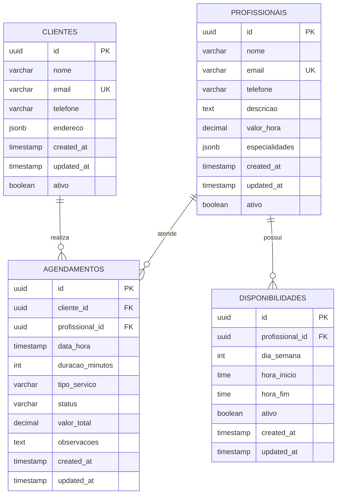

### Configurações Entity Framework

```csharp
public class AgendamentoConfiguration : IEntityTypeConfiguration<Agendamento>
{
    public void Configure(EntityTypeBuilder<Agendamento> builder)
    {
        builder.HasKey(x => x.Id);
        
        builder.Property(x => x.Id)
            .HasConversion(id => id.Value, value => new AgendamentoId(value));
            
        builder.Property(x => x.ClienteId)
            .HasConversion(id => id.Value, value => new ClienteId(value));
            
        builder.Property(x => x.DataHora)
            .IsRequired();
            
        builder.Property(x => x.Status)
            .HasConversion<string>();
            
        builder.Property(x => x.TipoServico)
            .HasConversion<string>();
            
        builder.HasOne<Cliente>()
            .WithMany()
            .HasForeignKey(x => x.ClienteId)
            .OnDelete(DeleteBehavior.Restrict);
            
        builder.HasOne<Profissional>()
            .WithMany()
            .HasForeignKey(x => x.ProfissionalId)
            .OnDelete(DeleteBehavior.Restrict);
            
        // Índices para performance
        builder.HasIndex(x => x.DataHora);
        builder.HasIndex(x => x.Status);
        builder.HasIndex(x => new { x.ProfissionalId, x.DataHora });
    }
}
```

### Migrações e Versionamento

```csharp
public partial class InitialCreate : Migration
{
    protected override void Up(MigrationBuilder migrationBuilder)
    {
        migrationBuilder.CreateTable(
            name: "Clientes",
            columns: table => new
            {
                Id = table.Column<Guid>(type: "uuid", nullable: false),
                Nome = table.Column<string>(type: "character varying(200)", maxLength: 200, nullable: false),
                Email = table.Column<string>(type: "character varying(100)", maxLength: 100, nullable: false),
                Telefone = table.Column<string>(type: "character varying(20)", maxLength: 20, nullable: false),
                Endereco = table.Column<string>(type: "jsonb", nullable: true),
                CreatedAt = table.Column<DateTime>(type: "timestamp with time zone", nullable: false, defaultValueSql: "CURRENT_TIMESTAMP"),
                UpdatedAt = table.Column<DateTime>(type: "timestamp with time zone", nullable: false, defaultValueSql: "CURRENT_TIMESTAMP"),
                Ativo = table.Column<bool>(type: "boolean", nullable: false, defaultValue: true)
            },
            constraints: table =>
            {
                table.PrimaryKey("PK_Clientes", x => x.Id);
            });
            
        migrationBuilder.CreateIndex(
            name: "IX_Clientes_Email",
            table: "Clientes", 
            column: "Email",
            unique: true);
    }
}
```

### Scripts de Seed Data

```csharp
public static class DatabaseSeeder
{
    public static async Task SeedAsync(FreteDbContext context)
    {
        if (!context.Profissionais.Any())
        {
            var profissionais = new List<Profissional>
            {
                Profissional.Create(
                    "João da Silva Transportes",
                    Email.Create("joao@transportes.com"),
                    Telefone.Create("11987654321"),
                    "Especialista em mudanças residenciais",
                    50.00m
                ),
                Profissional.Create(
                    "Maria Logística Ltda",
                    Email.Create("maria@logistica.com"),
                    Telefone.Create("11876543210"),
                    "Transporte de cargas comerciais",
                    75.00m
                )
            };
            
            context.Profissionais.AddRange(profissionais);
            await context.SaveChangesAsync();
        }
    }
}
```

## 🏗️ Arquitetura

### Arquitetura Modular

A infraestrutura utiliza uma **arquitetura modular** do Terraform que promove:

- 🔄 **Reutilização**: Módulos podem ser usados em diferentes ambientes
- 🧩 **Separação de Responsabilidades**: Cada módulo tem uma função específica
- 🔧 **Manutenibilidade**: Mudanças isoladas em módulos específicos
- 📊 **Testabilidade**: Módulos podem ser testados independentemente

### Fluxo de Deployment

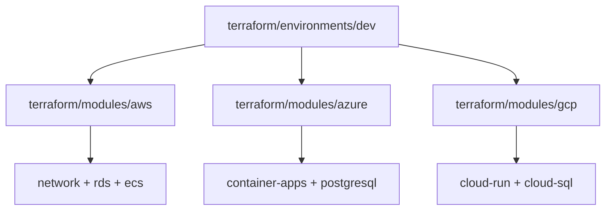

### AWS Architecture
```
┌─────────────────────────────────────────────────────────────┐
│                        AWS Cloud                           │
├─────────────────────────────────────────────────────────────┤
│  ┌─────────────┐    ┌──────────────┐    ┌─────────────┐    │
│  │     ALB     │────│  ECS Fargate │────│     RDS     │    │
│  │ (Public)    │    │  (Private)   │    │ (Private)   │    │
│  └─────────────┘    └──────────────┘    └─────────────┘    │
│         │                    │                   │         │
│  ┌─────────────┐    ┌──────────────┐    ┌─────────────┐    │
│  │   Route53   │    │     ECR      │    │ CloudWatch  │    │
│  │    (DNS)    │    │  (Registry)  │    │   (Logs)    │    │
│  └─────────────┘    └──────────────┘    └─────────────┘    │
└─────────────────────────────────────────────────────────────┘
```

### Azure Architecture
```
┌─────────────────────────────────────────────────────────────┐
│                       Azure Cloud                          │
├─────────────────────────────────────────────────────────────┤
│  ┌─────────────┐    ┌──────────────┐    ┌─────────────┐    │
│  │   Traffic   │────│ Container    │────│ PostgreSQL  │    │
│  │   Manager   │    │    Apps      │    │  Flexible   │    │
│  └─────────────┘    └──────────────┘    └─────────────┘    │
│         │                    │                   │         │
│  ┌─────────────┐    ┌──────────────┐    ┌─────────────┐    │
│  │     DNS     │    │     ACR      │    │ App Insights│    │
│  │             │    │  (Registry)  │    │   (APM)     │    │
│  └─────────────┘    └──────────────┘    └─────────────┘    │
└─────────────────────────────────────────────────────────────┘
```

### GCP Architecture
```
┌─────────────────────────────────────────────────────────────┐
│                      Google Cloud                          │
├─────────────────────────────────────────────────────────────┤
│  ┌─────────────┐    ┌──────────────┐    ┌─────────────┐    │
│  │ Cloud Load  │────│  Cloud Run   │────│  Cloud SQL  │    │
│  │  Balancer   │    │ (Serverless) │    │(PostgreSQL) │    │
│  └─────────────┘    └──────────────┘    └─────────────┘    │
│         │                    │                   │         │
│  ┌─────────────┐    ┌──────────────┐    ┌─────────────┐    │
│  │ Cloud DNS   │    │   Artifact   │    │ Stackdriver │    │
│  │             │    │   Registry   │    │ (Monitoring)│    │
│  └─────────────┘    └──────────────┘    └─────────────┘    │
└─────────────────────────────────────────────────────────────┘
```

## 📋 Pré-requisitos

### Versões Testadas e Compatíveis

| Ferramenta | Versão Mínima | Versão Testada | Notas |
|------------|---------------|----------------|---------|
| Terraform  | 1.5.0         | 1.6.x         | Requer providers 5.x |
| Docker     | 20.10.0       | 24.x          | Para build de imagens |
| AWS CLI    | 2.0.0         | 2.15.x        | Para deployment AWS |
| Azure CLI  | 2.50.0        | 2.56.x        | Para deployment Azure |
| GCP CLI    | 400.0.0       | 460.x         | Para deployment GCP |

### Ferramentas Necessárias

1. **Docker** (versão 20.10+)
   ```bash
   # Verificar versão
   docker --version
   ```

2. **Terraform** (versão 1.5+)
   ```bash
   # Instalar via Chocolatey (Windows)
   choco install terraform
   
   # Verificar versão
   terraform --version
   ```

3. **Git** 
   ```bash
   git --version
   ```

### CLIs dos Provedores de Nuvem

#### AWS CLI
```bash
# Instalar
curl "https://awscli.amazonaws.com/awscli-exe-linux-x86_64.zip" -o "awscliv2.zip"
unzip awscliv2.zip
sudo ./aws/install

# Configurar
aws configure
```

#### Azure CLI
```bash
# Instalar (Windows)
choco install azure-cli

# Login
az login
```

#### Google Cloud CLI
```bash
# Instalar
curl https://sdk.cloud.google.com | bash

# Inicializar
gcloud init
```

### Permissões Necessárias

#### AWS
- `AdministratorAccess` (ou permissões específicas para ECS, RDS, VPC, IAM)

#### Azure
- `Contributor` role na subscription
- Permissões para criar Resource Groups

#### GCP
- `Editor` role no projeto
- APIs habilitadas: Cloud Run, Cloud SQL, Artifact Registry

## 📁 Estrutura do Projeto

```
terraform/
├── modules/                      # Módulos reutilizáveis
│   ├── common/                   # Recursos compartilhados
│   │   ├── docker/              # Templates Docker
│   │   └── docker-compose/      # Configurações Docker Compose
│   ├── aws/                     # Módulos AWS
│   │   ├── main.tf              # Orquestrador principal AWS
│   │   ├── variables.tf         # Variáveis do módulo AWS
│   │   ├── outputs.tf           # Outputs do módulo AWS
│   │   ├── network/             # VPC, subnets, security groups
│   │   ├── rds/                 # PostgreSQL RDS
│   │   └── ecs/                 # ECS Fargate + ALB
│   ├── azure/                   # Módulo Azure
│   │   ├── main.tf              # Container Apps + PostgreSQL
│   │   ├── variables.tf         # Variáveis do módulo Azure
│   │   └── outputs.tf           # Outputs do módulo Azure
│   └── gcp/                     # Módulo GCP
│       ├── main.tf              # Cloud Run + Cloud SQL
│       ├── variables.tf         # Variáveis do módulo GCP
│       └── outputs.tf           # Outputs do módulo GCP
├── environments/                 # Configurações por ambiente
│   ├── dev/                     # Ambiente de desenvolvimento
│   │   ├── main.tf              # Configuração principal dev
│   │   ├── variables.tf         # Variáveis do ambiente dev
│   │   ├── outputs.tf           # Outputs do ambiente dev
│   │   └── terraform.tfvars.example
│   └── prod/                    # Ambiente de produção
│       ├── main.tf              # Configuração principal prod
│       ├── variables.tf         # Variáveis do ambiente prod
│       ├── outputs.tf           # Outputs do ambiente prod
│       └── terraform.tfvars.example
├── scripts/                     # Scripts de automação
│   ├── deploy.sh               # Script de deploy (Linux/Mac)
│   ├── deploy.bat              # Script de deploy (Windows)
│   └── destroy.sh              # Script de destruição
├── main.tf                     # Configuração principal raiz
├── variables.tf               # Variáveis globais
├── outputs.tf                 # Outputs globais
├── providers.tf               # Configuração dos providers
└── README.md                  # Esta documentação
```

## ⚙️ Configuração

### 1. Clonar o Repositório
```bash
git clone <repository-url>
cd FreteAPI/terraform
```

### 2. Estrutura dos Arquivos Principais

Os arquivos na raiz do diretório terraform/ servem como configuração global:

- **main.tf**: Configuração principal que orquestra todos os módulos
- **providers.tf**: Definição dos providers (AWS, Azure, GCP) e versões
- **variables.tf**: Variáveis globais compartilhadas entre ambientes
- **outputs.tf**: Outputs principais da infraestrutura

### 3. Configurar Variáveis

#### Desenvolvimento
```bash
cd environments/dev
cp terraform.tfvars.example terraform.tfvars
```

Editar `terraform.tfvars`:
```hcl
# Seleção do provedor
deploy_to_aws   = true
deploy_to_azure = false  
deploy_to_gcp   = false

# AWS
aws_region = "us-east-1"

# Banco de dados
database_name     = "freteapi"
database_username = "freteapi"
database_password = "SuaSenhaSegura123!"

# Aplicação
api_image      = "freteapi:latest"
api_version    = "v1.0.0"
run_migrations = true
```

#### Produção
```bash
cd environments/prod
cp terraform.tfvars.example terraform.tfvars
```

⚠️ **Importante**: Use senhas mais fortes e configure backends de estado para produção.

### 3. Configurar Backend de Estado (Opcional)

#### AWS S3
```hcl
terraform {
  backend "s3" {
    bucket         = "seu-bucket-terraform-state"
    key            = "freteapi/prod/terraform.tfstate"
    region         = "us-east-1"
    encrypt        = true
    dynamodb_table = "terraform-lock"
  }
}
```

#### Azure Storage
```hcl
terraform {
  backend "azurerm" {
    resource_group_name  = "terraform-state-rg"
    storage_account_name = "terraformstateprod"
    container_name       = "tfstate"
    key                  = "freteapi/prod/terraform.tfstate"
  }
}
```

## 🚀 Deploy

### Deploy Automatizado (Recomendado)

#### Linux/Mac
```bash
# Deploy em desenvolvimento (AWS)
./scripts/deploy.sh --environment dev --cloud aws

# Deploy em produção (todos os provedores)
./scripts/deploy.sh --environment prod --cloud all

# Deploy sem build da imagem
./scripts/deploy.sh --environment dev --cloud aws --build false
```

#### Windows
```cmd
REM Deploy em desenvolvimento (AWS)
scripts\deploy.bat --environment dev --cloud aws

REM Deploy em produção (Azure)
scripts\deploy.bat --environment prod --cloud azure
```

### Deploy Manual

```bash
# 1. Navegar para o ambiente desejado
cd environments/dev  # ou environments/prod

# 2. Inicializar Terraform (baixa providers e módulos)
terraform init

# 3. Planejar deployment
terraform plan -var="deploy_to_aws=true" -var="deploy_to_azure=false" -var="deploy_to_gcp=false"

# 4. Aplicar mudanças
terraform apply
```

**Nota**: Cada ambiente (dev/prod) tem sua própria configuração e estado do Terraform, permitindo deployments independentes.

### Verificar Deploy

```bash
# Visualizar outputs
terraform output

# Exemplo de output:
# aws_api_url = "http://freteapi-dev-alb-123456789.us-east-1.elb.amazonaws.com"
# aws_database_endpoint = "freteapi-dev-db.123456789.us-east-1.rds.amazonaws.com"
```

## 🌍 Ambientes

### Desenvolvimento (dev)
- **Recursos**: Mínimos para testes
- **Banco**: Instâncias pequenas, backups de 3 dias
- **Escalabilidade**: 1-5 instâncias
- **Custos**: Otimizado para desenvolvimento

### Produção (prod)
- **Recursos**: Alta disponibilidade
- **Banco**: Instâncias com backup de 30 dias
- **Escalabilidade**: 2-20 instâncias
- **Segurança**: Proteções adicionais habilitadas

## ☁️ Provedores de Nuvem

### AWS (Amazon Web Services)

#### Recursos Criados
- **ECS Cluster**: Orquestração de containers
- **Fargate Tasks**: Containers serverless
- **Application Load Balancer**: Distribuição de tráfego
- **RDS PostgreSQL**: Banco de dados gerenciado
- **VPC**: Rede privada isolada
- **ECR**: Registry de imagens Docker
- **CloudWatch**: Logs e métricas

#### Custos Estimados (dev)
- ECS Fargate: ~$15/mês
- RDS db.t3.micro: ~$15/mês
- ALB: ~$20/mês
- **Total**: ~$50/mês

### Azure

#### Recursos Criados
- **Container Apps**: Containers serverless
- **PostgreSQL Flexible Server**: Banco gerenciado
- **Container Registry**: Registry de imagens
- **Application Insights**: APM e monitoramento
- **Key Vault**: Gerenciamento de secrets

#### Custos Estimados (dev)
- Container Apps: ~$10/mês
- PostgreSQL B1ms: ~$20/mês
- Container Registry: ~$5/mês
- **Total**: ~$35/mês

### Google Cloud Platform

#### Recursos Criados
- **Cloud Run**: Containers serverless
- **Cloud SQL**: PostgreSQL gerenciado
- **Artifact Registry**: Registry de imagens
- **VPC**: Rede privada
- **Cloud Monitoring**: Métricas e alertas

#### Custos Estimados (dev)
- Cloud Run: ~$5/mês
- Cloud SQL db-f1-micro: ~$10/mês
- Artifact Registry: ~$2/mês
- **Total**: ~$17/mês

## 📊 Monitoramento

### AWS CloudWatch
- **Logs**: Logs da aplicação e sistema
- **Métricas**: CPU, memória, rede
- **Alarmes**: Alertas automáticos

### Azure Application Insights
- **APM**: Performance da aplicação
- **Distributed Tracing**: Rastreamento de requisições
- **Dependency Tracking**: Monitoramento de dependências

### GCP Cloud Monitoring
- **Uptime Checks**: Verificação de disponibilidade
- **Error Reporting**: Análise de erros
- **Trace**: Rastreamento de latência

## 🔒 Segurança

### Rede
- **VPCs Privadas**: Isolamento de rede
- **Security Groups**: Regras de firewall
- **SSL/TLS**: Criptografia em trânsito

### Banco de Dados
- **Encryption at Rest**: Dados criptografados
- **Private Subnets**: Bancos isolados
- **Backup Criptografado**: Backups seguros

### Autenticação
- **IAM Roles**: Princípio de menor privilégio
- **Service Accounts**: Identidades gerenciadas
- **Secrets Management**: Gerenciamento seguro de secrets

### Compliance
- **GDPR**: Proteção de dados pessoais
- **SOC 2**: Controles de segurança
- **ISO 27001**: Gestão de segurança da informação

## 🔧 Solução de Problemas

### Problemas Comuns

#### 1. Erro de Autenticação
```bash
# AWS
aws sts get-caller-identity

# Azure  
az account show

# GCP
gcloud auth list
```

#### 2. Terraform State Lock
```bash
# AWS DynamoDB
terraform force-unlock <LOCK_ID>

# Azure/GCP
# Remover lock manualmente no console
```

#### 3. Imagem Docker Não Encontrada
```bash
# Verificar se a imagem existe
docker images | grep freteapi

# Rebuild se necessário
docker build -t freteapi:latest .
```

#### 4. Conectividade com Banco
```bash
# Verificar security groups
# Verificar se o banco está no mesmo VPC
# Verificar string de conexão
```

### Logs e Debugging

#### AWS
```bash
# Logs do ECS
aws logs describe-log-groups --log-group-name-prefix "/aws/ecs/freteapi"
aws logs get-log-events --log-group-name "/aws/ecs/freteapi-dev" --log-stream-name "<stream>"
```

#### Azure
```bash
# Logs do Container App
az containerapp logs show --name freteapi-dev-api --resource-group freteapi-dev-rg
```

#### GCP
```bash
# Logs do Cloud Run
gcloud logging read "resource.type=cloud_run_revision" --limit 50
```

### Comandos Úteis

```bash
# Verificar estado do Terraform
terraform show

# Importar recursos existentes
terraform import <resource_type>.<resource_name> <resource_id>

# Atualizar providers
terraform init -upgrade

# Validar configuração
terraform validate

# Formatar código
terraform fmt -recursive
```

## 📝 Comandos de Gerenciamento

### Destruir Infraestrutura
```bash
# Usando script
./scripts/destroy.sh --environment dev --cloud aws

# Manual
terraform destroy -var="deploy_to_aws=true"
```

### Atualização de Recursos
```bash
# Aplicar apenas mudanças específicas
terraform apply -target=module.aws.module.ecs

# Recriar recurso
terraform taint module.aws.module.ecs.aws_ecs_service.api
terraform apply
```

### Backup e Restore
```bash
# Export state
terraform show -json > terraform-state-backup.json

# Lista de recursos
terraform state list
```

## 📞 Suporte

Para suporte e dúvidas:

1. **Documentação**: Consulte esta documentação
2. **Logs**: Verifique os logs da aplicação
3. **Issues**: Abra uma issue no repositório
4. **Community**: Terraform Community Forum

### 🔄 Atualizações Futuras

Roadmap de melhorias planejadas:

- [ ] **GitOps**: Implementar GitOps com ArgoCD/Flux para deployment contínuo
- [ ] **Testes de Infraestrutura**: Adicionar testes automatizados com Terratest
- [ ] **Blue/Green Deployments**: Implementar estratégias de deployment sem downtime  
- [ ] **Web Application Firewall**: Adicionar WAF e proteção DDoS
- [ ] **Disaster Recovery**: Implementar estratégias de recuperação entre regiões
- [ ] **Service Mesh**: Adicionar Istio para comunicação segura entre serviços
- [ ] **Infrastructure as Code Security**: Integrar Checkov/Terrascan para segurança
- [ ] **Cost Optimization**: Implementar políticas de otimização de custos automatizadas
- [ ] **Multi-Region**: Suporte a deployment multi-região para alta disponibilidade
- [ ] **Observability**: Integração com OpenTelemetry e distributed tracing

### 📊 Métricas de Infraestrutura

Esta implementação foi projetada para suportar:

- **Escalabilidade**: 10,000+ requisições por minuto
- **Disponibilidade**: 99.9% uptime (SLA)
- **Recovery Time**: < 15 minutos (RTO)
- **Recovery Point**: < 5 minutos (RPO)
- **Multi-Region**: Suporte a 3+ regiões simultâneas

---

**Versão**: 1.0.0  
**Última Atualização**: 2026-01-05  
**Mantido por**: DevOps Team